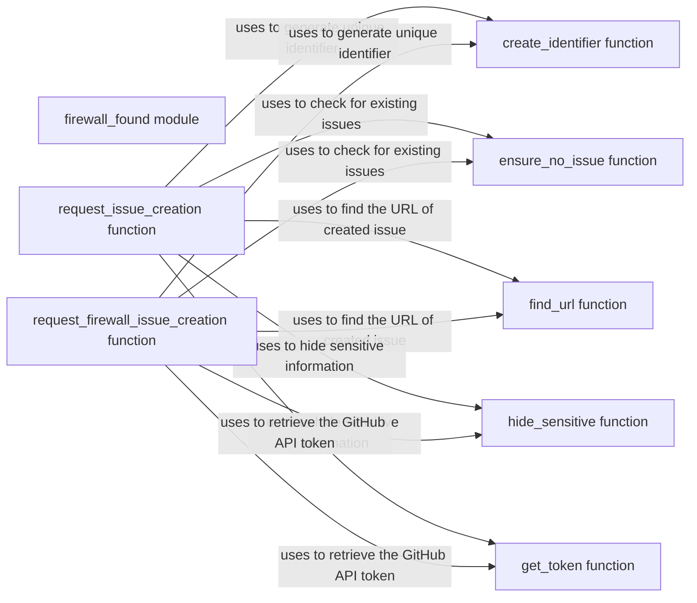

## Component Details

The Firewall Detection and Reporting component is responsible for identifying unknown firewalls and reporting them by creating GitHub issues. It generates unique identifiers for each firewall fingerprint, checks for existing issues to avoid duplicates, and creates new issues with relevant information such as the WhatWaf version, running context, and firewall fingerprint. The component also handles exceptions during issue creation, providing users with prompts and error messages. It interacts with the GitHub API to search for and create issues, ensuring that sensitive information is hidden from the issue body.

### firewall_found module
This module contains functions for creating identifiers, checking for existing issues, finding issue URLs, hiding sensitive information, and requesting the creation of GitHub issues for unhandled exceptions or unknown firewalls.
- **Related Classes/Methods**: `WhatWaf.lib.firewall_found` (full file reference)

### create_identifier function
This function creates a SHA1 hash of the input data and returns the first 9 characters of the hexadecimal representation of the hash. It's used to generate a unique identifier for issues and firewall fingerprints.
- **Related Classes/Methods**: `WhatWaf.lib.firewall_found.create_identifier` (18:24)

### request_issue_creation function
This function handles the creation of a GitHub issue for unhandled exceptions encountered during the program's execution. It prompts the user to create an issue, gathers relevant information (WhatWaf version, running context, Python version, traceback, platform), and submits it to GitHub. It interacts with lib.settings to check the version and save temporary issues, and lib.formatter for user prompts and error messages.
- **Related Classes/Methods**: `WhatWaf.lib.firewall_found.request_issue_creation` (101:164)

### request_firewall_issue_creation function
This function handles the creation of a GitHub issue for unknown firewalls detected by the program. It prompts the user to create an issue, reads the firewall fingerprint from a file, gathers relevant information (WhatWaf version, running context, fingerprint), and submits it to GitHub. It interacts with lib.settings to check the version.
- **Related Classes/Methods**: `WhatWaf.lib.firewall_found.request_firewall_issue_creation` (167:235)

### ensure_no_issue function
This function checks if an issue with a given identifier already exists on the WhatWaf GitHub repository. It searches both open and closed issues to prevent duplicate reports.
- **Related Classes/Methods**: `WhatWaf.lib.firewall_found.ensure_no_issue` (39:57)

### find_url function
This function searches the WhatWaf GitHub issues page for a specific issue based on its identifier and returns the URL of the issue.
- **Related Classes/Methods**: `WhatWaf.lib.firewall_found.find_url` (60:84)

### hide_sensitive function
This function replaces sensitive information (like URLs) in the command-line arguments with asterisks to prevent them from being exposed in the issue body.
- **Related Classes/Methods**: `WhatWaf.lib.firewall_found.hide_sensitive` (87:98)

### get_token function
This function retrieves the GitHub API token from a file. The token is used to authenticate the issue creation requests.
- **Related Classes/Methods**: `WhatWaf.lib.firewall_found.get_token` (27:36)