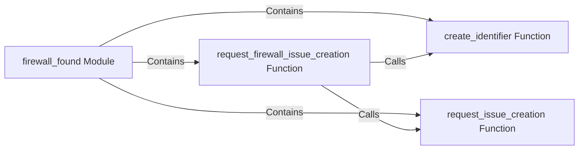

## Component Details

The Firewall Identification component is responsible for detecting and reporting firewalls. It involves generating unique identifiers for each detected firewall, creating issues or tickets in a tracking system, and managing firewall-related data. The process starts with detecting a firewall, generating a unique identifier, and then creating an issue to track the finding.

### firewall_found Module
This module serves as a central repository for classes and functions related to representing and managing information about detected firewalls. It encapsulates the logic for handling firewall-related data and actions, providing a structured way to interact with firewall findings.
- **Related Classes/Methods**: `WhatWaf.lib.firewall_found`

### create_identifier Function
This function is responsible for generating a unique identifier for each detected firewall instance. The identifier is crucial for tracking and managing individual firewall findings, ensuring that each detected firewall can be uniquely identified and referenced.
- **Related Classes/Methods**: `WhatWaf.lib.firewall_found:create_identifier`

### request_issue_creation Function
This function initiates the process of creating an issue or ticket in a tracking system for a general finding. It likely involves formatting the necessary information and sending a request to the appropriate issue tracking system, providing a standardized way to report and track detected issues.
- **Related Classes/Methods**: `WhatWaf.lib.firewall_found:request_issue_creation`

### request_firewall_issue_creation Function
This function is specifically responsible for creating an issue related to a detected firewall. It builds upon the `request_issue_creation` function, adding firewall-specific details to the issue, ensuring that all relevant information about the detected firewall is included in the issue.
- **Related Classes/Methods**: `WhatWaf.lib.firewall_found:request_firewall_issue_creation`