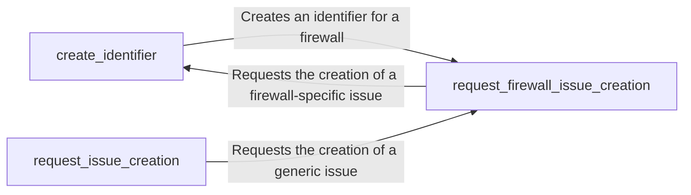

## Component Details

The Firewall Identifier component is responsible for detecting Web Application Firewalls (WAFs) by analyzing HTTP responses and creating corresponding issues or reports. It encompasses functionalities for generating unique identifiers for detected firewalls, handling requests for creating generic issues, and specifically managing the creation of firewall-related issues. The component aims to streamline the process of identifying and reporting WAF presence, contributing to a more secure web environment.

### create_identifier
This function generates a unique identifier for each detected firewall. This identifier is likely used for tracking and managing firewall instances within the system. It ensures that each identified firewall can be uniquely referenced and managed throughout the application's lifecycle.
- **Related Classes/Methods**: `WhatWaf.lib.firewall_found:create_identifier`

### request_issue_creation
This function handles requests to create generic issues. It takes issue information as input and triggers the process of creating a new issue in a tracking system or similar platform. This allows for the reporting of general problems or anomalies detected during the firewall identification process.
- **Related Classes/Methods**: `WhatWaf.lib.firewall_found:request_issue_creation`

### request_firewall_issue_creation
This function is specifically designed to handle requests for creating issues related to firewalls. It may include firewall-specific logic, such as predefined issue types or specialized data formatting. This ensures that firewall-related issues are properly categorized and handled within the issue tracking system.
- **Related Classes/Methods**: `WhatWaf.lib.firewall_found:request_firewall_issue_creation`