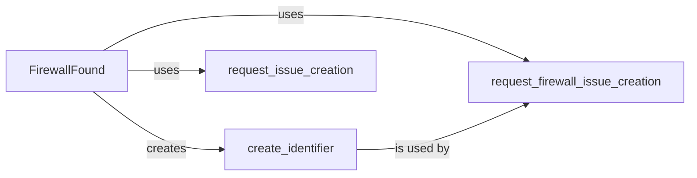

## Component Details

The Firewall Identifier component is responsible for detecting and reporting web application firewalls (WAFs). It involves identifying firewalls, creating unique identifiers for them, and requesting the creation of issues to track and manage the detected firewalls. The core functionality revolves around the `FirewallFound` class, which encapsulates the logic for creating identifiers and requesting issue creation.

### FirewallFound
Represents a detected firewall. It encapsulates the information about the firewall and provides methods for creating identifiers and requesting issue creation. It serves as a central point for managing firewall detections and reporting them.
- **Related Classes/Methods**: `WhatWaf.lib.firewall_found.FirewallFound`, `WhatWaf.lib.firewall_found.FirewallFound.create_identifier`, `WhatWaf.lib.firewall_found.FirewallFound.request_issue_creation`, `WhatWaf.lib.firewall_found.FirewallFound.request_firewall_issue_creation`
- **Source Files**: `WhatWaf/lib/firewall_found.py`

### create_identifier
Generates a unique identifier for a detected firewall. This identifier is used for tracking and managing firewall detections. It ensures that each detected firewall has a unique ID for reporting and analysis.
- **Related Classes/Methods**: `WhatWaf.lib.firewall_found.FirewallFound.create_identifier`
- **Source Files**: `WhatWaf/lib/firewall_found.py`

### request_issue_creation
Requests the creation of a generic issue. This could be used for reporting various findings or problems detected during the scan. It provides a way to report general issues encountered during the firewall detection process.
- **Related Classes/Methods**: `WhatWaf.lib.firewall_found.FirewallFound.request_issue_creation`
- **Source Files**: `WhatWaf/lib/firewall_found.py`

### request_firewall_issue_creation
Requests the creation of a specific issue related to a detected firewall. This allows for detailed reporting and tracking of firewall-related findings. It enables the reporting of specific issues related to the detected firewall, providing more granular tracking and analysis.
- **Related Classes/Methods**: `WhatWaf.lib.firewall_found.FirewallFound.request_firewall_issue_creation`
- **Source Files**: `WhatWaf/lib/firewall_found.py`