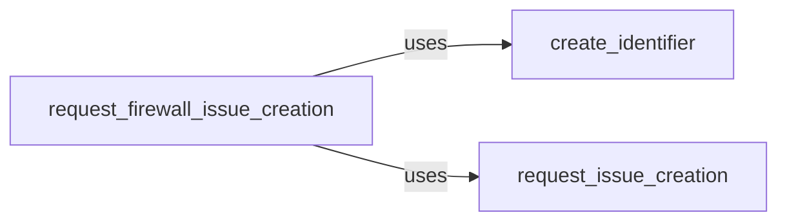

## Component Details

The Firewall Identifier component is responsible for accurately identifying the specific Web Application Firewall (WAF) in use. It achieves this by analyzing the responses received from the target and creating unique identifiers for each identified firewall. This component also manages the creation of issues related to firewall identification, facilitating tracking and resolution of potential problems.

### create_identifier
This function generates a unique identifier for a detected firewall. This identifier is crucial for tracking and managing issues associated with that particular firewall instance. It ensures that each firewall is uniquely identified, allowing for targeted analysis and issue resolution.
- **Source Reference**: `WhatWaf.lib.firewall_found:create_identifier`
  - *File*: `WhatWaf/lib/firewall_found.py`

### request_issue_creation
This function handles requests to create generic issues. It receives information about the issue and initiates the process of creating a new issue in a tracking system or database. This function serves as a central point for issue creation, ensuring consistency and proper handling of issue reports.
- **Source Reference**: `WhatWaf.lib.firewall_found:request_issue_creation`
  - *File*: `WhatWaf/lib/firewall_found.py`

### request_firewall_issue_creation
This function is specifically designed to handle requests for creating issues related to identified firewalls. It utilizes the firewall identifier, along with other relevant information, to generate a detailed issue report. This function ensures that firewall-related issues are properly documented and tracked.
- **Source Reference**: `WhatWaf.lib.firewall_found:request_firewall_issue_creation`
  - *File*: `WhatWaf/lib/firewall_found.py`