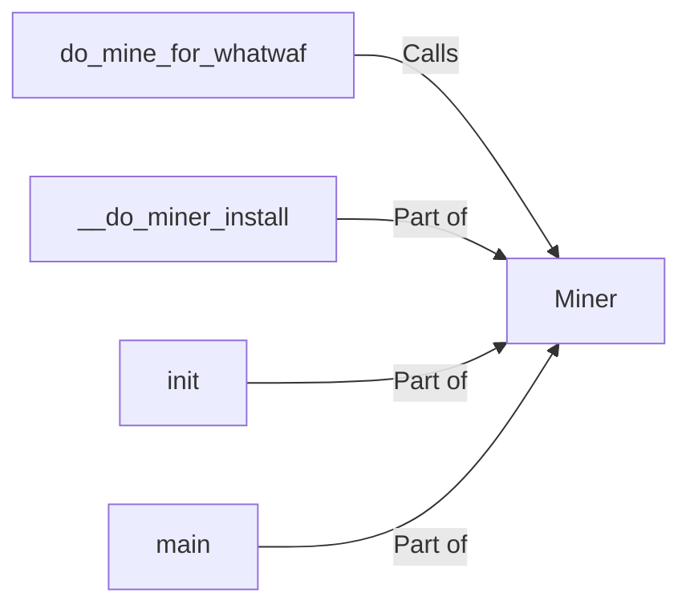

## Component Details

The Knowledge Miner component is responsible for dynamically extending WhatWaf's WAF detection capabilities by integrating with external "miner" modules. It orchestrates the process of installing, configuring, and executing these miners to discover new WAF fingerprints and detection techniques. The component's core functionality revolves around the `Miner` class, which handles sending HTTP requests, analyzing responses, and identifying WAF signatures. The `do_mine_for_whatwaf` function serves as the entry point, initiating the mining process with specified target URLs and request patterns. The miner installation is handled by `__do_miner_install` method.

### do_mine_for_whatwaf
This function acts as the entry point for initiating a WAF detection scan using the miner. It configures the mining process by setting parameters like target URLs and request patterns, and then triggers the execution of the Miner class.
- **Related Classes/Methods**: `WhatWaf.lib.settings:do_mine_for_whatwaf`

### Miner
The Miner class encapsulates the core WAF detection logic. It handles sending HTTP requests, analyzing responses, and identifying WAF signatures. It also manages the installation of dependencies required for the mining process, ensuring the environment is properly set up for detection.
- **Related Classes/Methods**: `WhatWaf.lib.miner.Miner`

### __do_miner_install
This method is responsible for installing any dependencies or components required for the WAF detection process. This could involve downloading and configuring necessary tools or libraries, ensuring that the miner has all the necessary resources to function correctly.
- **Related Classes/Methods**: `WhatWaf.lib.miner.Miner:__do_miner_install`

### init
The init method initializes the Miner object by setting up internal data structures, configuring request parameters, and preparing the environment for WAF detection. It ensures that the Miner object is properly configured before the detection process begins.
- **Related Classes/Methods**: `WhatWaf.lib.miner.Miner:init`

### main
The main method orchestrates the WAF detection process. It sends HTTP requests, analyzes responses, and identifies WAF signatures. It represents the core execution flow of the WAF detection process, driving the detection logic from start to finish.
- **Related Classes/Methods**: `WhatWaf.lib.miner.Miner:main`