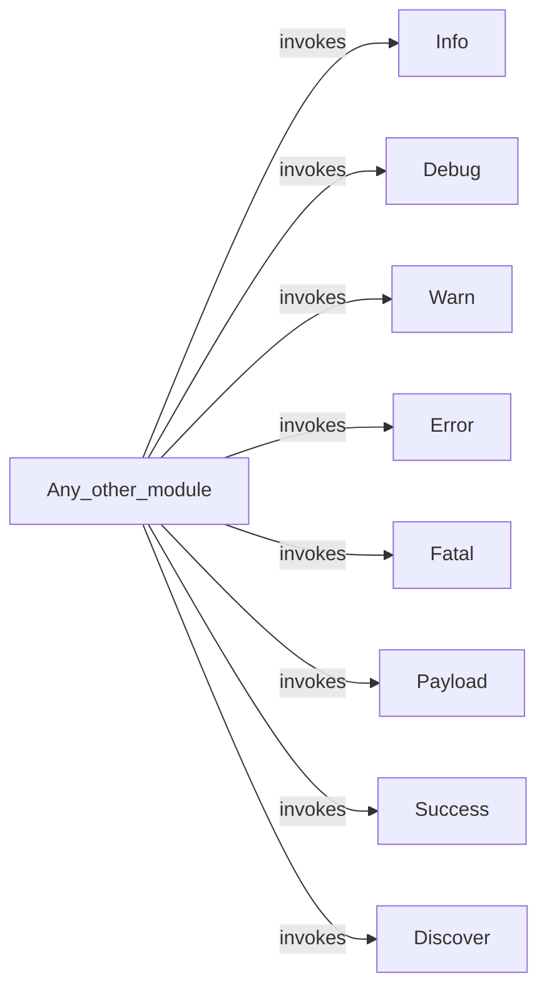

## Component Details

The Logging and Reporting component in WhatWaf provides a centralized and consistent way to log messages of varying severity levels, including informational, debugging, warning, error, fatal, payload, success, and discovery messages. This component ensures that all significant events and potential issues are properly recorded, offering valuable insights into the tool's operation and facilitating debugging and troubleshooting. The core functionality resides within the `formatter.py` module, which defines functions for each log level. These functions are invoked throughout the WhatWaf codebase to generate and output log messages.

### Info
Logs an informational message to the console, providing general information about the tool's progress or status.
- **Related Classes/Methods**: `WhatWaf.lib.formatter:info`

### Debug
Logs a debug message to the console, offering detailed information for debugging purposes. These messages are typically more verbose and are intended for developers.
- **Related Classes/Methods**: `WhatWaf.lib.formatter:debug`

### Warn
Logs a warning message to the console, indicating a potential issue or unexpected behavior that doesn't necessarily prevent the tool from functioning but should be investigated.
- **Related Classes/Methods**: `WhatWaf.lib.formatter:warn`

### Error
Logs an error message to the console, indicating a problem that requires attention and may impact the tool's functionality.
- **Related Classes/Methods**: `WhatWaf.lib.formatter:error`

### Fatal
Logs a fatal error message to the console, indicating a critical problem that prevents the tool from continuing execution. This usually results in program termination.
- **Related Classes/Methods**: `WhatWaf.lib.formatter:fatal`

### Payload
Logs a payload message to the console, typically used for displaying data being sent or received. This is useful for debugging network interactions.
- **Related Classes/Methods**: `WhatWaf.lib.formatter:payload`

### Success
Logs a success message to the console, indicating that an operation has completed successfully.
- **Related Classes/Methods**: `WhatWaf.lib.formatter:success`

### Discover
Logs a discovery message to the console, typically used when new information or resources are found during the tool's operation.
- **Related Classes/Methods**: `WhatWaf.lib.formatter:discover`