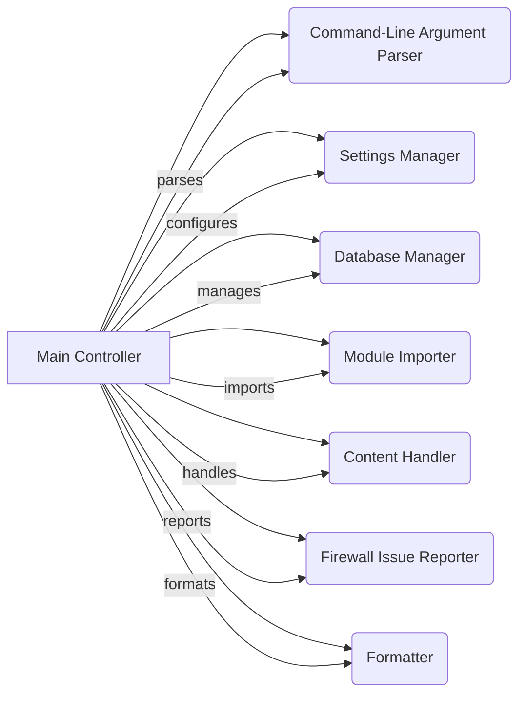

```mermaid
graph LR
    A[Main Controller] --> B(Command-Line Argument Parser)
    A --> C(Settings Manager)
    A --> D(Database Manager)
    A --> E(Module Importer)
    A --> F(Content Handler)
    A --> G(Firewall Issue Reporter)
    A --> H(Formatter)

    A -- "parses" --> B
    A -- "configures" --> C
    A -- "manages" --> D
    A -- "imports" --> E
    A -- "handles" --> F
    A -- "reports" --> G
    A -- "formats" --> H


```

