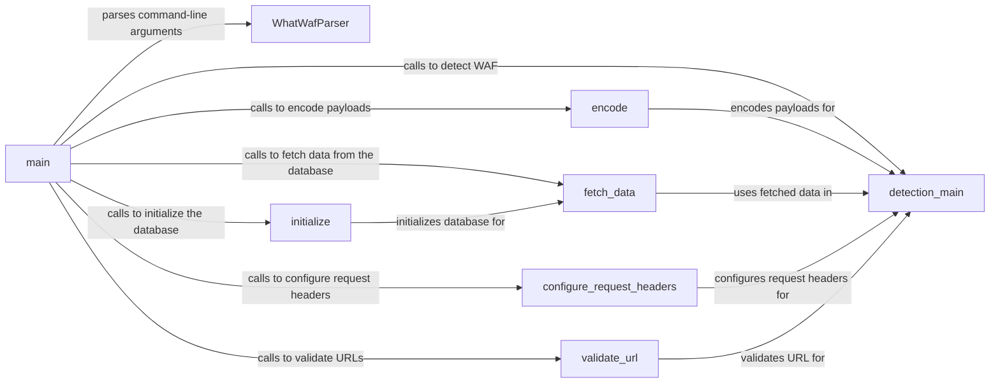

## Component Details

The WhatWaf application's main flow begins with parsing command-line arguments using `WhatWafParser`. The `main` function then initializes the database, configures request headers, and validates the target URL. The core WAF detection logic resides in the `detection_main` function, which sends HTTP requests with encoded payloads to the target and analyzes the responses. Payloads are encoded using the `encode` function to bypass WAF filters. The application interacts with a SQLite database through `initialize` and `fetch_data` to cache URLs and payloads. Helper functions like `validate_url`, `test_target_connection`, `parse_burp_request`, `auto_assign`, and `check_url_against_cached` provide additional functionalities for URL validation, connection testing, Burp request parsing, protocol assignment, and cache checking.

### main
The main function serves as the entry point of the WhatWaf tool. It orchestrates the entire WAF detection process, from parsing command-line arguments to running scans against specified targets. It initializes the database, configures request settings, and calls the core detection logic.
- **Related Classes/Methods**: `WhatWaf.trigger.main:main` (61:564)

### WhatWafParser
The `WhatWafParser` class is responsible for parsing command-line arguments, defining available options, and providing a structured way to configure the tool's behavior. It uses the `argparse` module to handle argument parsing.
- **Related Classes/Methods**: `WhatWaf.cmd.WhatWafParser` (None:None)

### detection_main
The `detection_main` function is the core of the WAF detection logic. It takes a URL and a list of payloads as input, sends HTTP requests to the target, and analyzes the responses to identify the presence of a WAF. It utilizes various techniques such as payload encoding and bypass checks to improve detection accuracy.
- **Related Classes/Methods**: `WhatWaf.content.detection_main:detection_main` (395:729)

### encode
The `encode` function is responsible for encoding payloads using various techniques to bypass WAF filters and improve detection rates. It takes a payload and a load path as input, applies the specified encoding, and returns the encoded payload.
- **Related Classes/Methods**: `WhatWaf.content.encode:encode` (220:225)

### initialize
The `initialize` function is responsible for initializing the SQLite database. It creates the necessary tables and returns a cursor object for interacting with the database. The database is used to store cached URLs and payloads.
- **Related Classes/Methods**: `WhatWaf.lib.database:initialize` (8:36)

### fetch_data
The `fetch_data` function retrieves data from the SQLite database. It takes a cursor object and an optional flag indicating whether to fetch payloads or URLs. It returns a list of cached URLs or payloads.
- **Related Classes/Methods**: `WhatWaf.lib.database:fetch_data` (39:51)

### configure_request_headers
The `configure_request_headers` function configures the HTTP request headers. It takes various options such as random agent, personal agent, proxy, and Tor as input, and returns a proxy and an agent object. These objects are used to customize the HTTP requests sent to the target.
- **Related Classes/Methods**: `WhatWaf.lib.settings:configure_request_headers` (426:473)

### validate_url
The `validate_url` function validates a URL. It takes a URL as input and returns the URL if it is valid, otherwise it returns None.
- **Related Classes/Methods**: `WhatWaf.lib.settings:validate_url` (338:342)