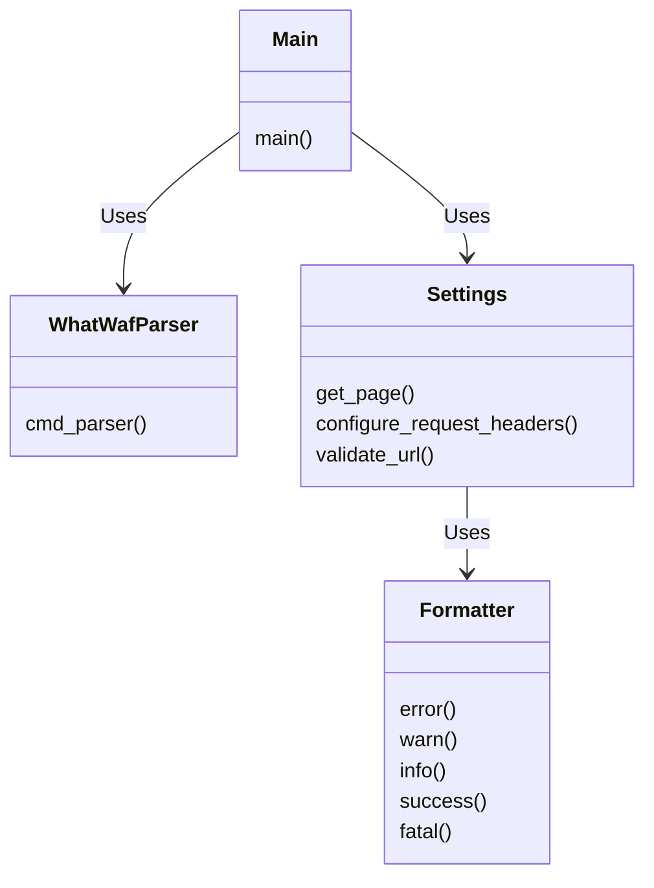

## Component Diagram: Main Execution & Configuration

### Component Descriptions:

*   **Main (repos.WhatWaf.trigger.main:main)**
    *Description:* The main entry point of the application. It orchestrates the argument parsing, configuration, and execution of the WAF detection process.
    *Interaction:* It uses `WhatWafParser` to parse command-line arguments and `Settings` to configure the environment and request headers.
    *Source File:* `repos.WhatWaf.trigger.main`

*   **WhatWafParser (lib.cmd.WhatWafParser)**
    *Description:* Parses command-line arguments using `cmd_parser` to configure the tool's behavior.
    *Interaction:* It is used by `Main` to process command-line inputs.
    *Source File:* `lib.cmd.WhatWafParser`

*   **Settings (lib.settings)**
    *Description:* Provides settings and configuration options, including URL validation, request header configuration, and fetching web pages. Methods like `get_page`, `configure_request_headers`, and `validate_url` are used.
    *Interaction:* It is used by `Main` to configure the environment and request headers. It uses `Formatter` for outputting messages.
    *Source File:* `lib.settings`

*   **Formatter (lib.formatter)**
    *Description:* Handles output formatting for different message types (error, info, warn, success, fatal).
    *Interaction:* It is used by `Settings` to format output messages.
    *Source File:* `lib.formatter`
