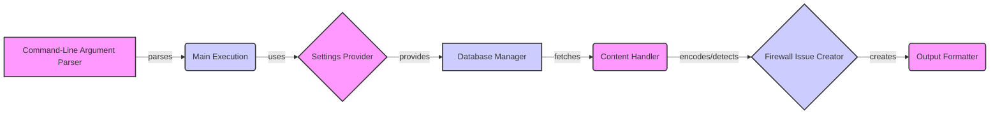

### Component Descriptions:

*   **Command-Line Argument Parser**: Parses command-line arguments provided by the user. It then passes the parsed arguments to the Main Execution component.
    *   Relevant source files: `lib.cmd.WhatWafParser`

*   **Main Execution**: Handles argument parsing, configuration, and orchestrates the WAF detection process. It uses the Settings Provider to get configurations and the Database Manager to fetch data, and then triggers the Content Handler. Finally, it uses the Output Formatter to display the results.
    *   Relevant source files: `repos.WhatWaf.trigger.main`

*   **Settings Provider**: Provides settings and configurations for the program, such as URL validation, page retrieval, and request header configuration. It is used by the Main Execution component to configure the WAF detection process.
    *   Relevant source files: `lib.settings`

*   **Database Manager**: Manages database interactions, including fetching, initializing, and inserting data. It provides data to the Content Handler.
    *   Relevant source files: `lib.database`

*   **Content Handler**: Handles content encoding and detection logic. It receives data from the Database Manager, encodes it, and performs WAF detection. If a firewall is detected, it notifies the Firewall Issue Creator.
    *   Relevant source files: `content`

*   **Firewall Issue Creator**: Deals with creating issues when a firewall is detected. It receives notifications from the Content Handler and uses the Output Formatter to display the issue.
    *   Relevant source files: `lib.firewall_found`

*   **Output Formatter**: Handles output formatting (error, info, warn, success, fatal). It is used by the Main Execution and Firewall Issue Creator components to display information to the user.
    *   Relevant source files: `lib.formatter`
