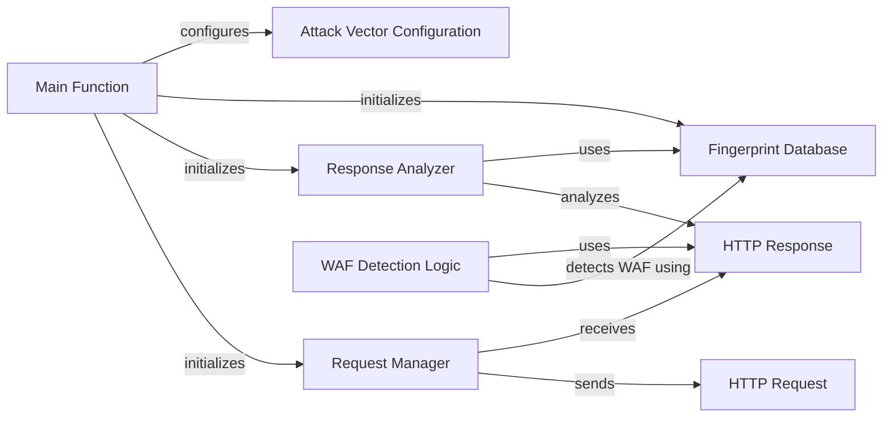

## Component Details

The WhatWaf tool detects Web Application Firewalls (WAFs) by sending HTTP requests with various attack vectors and analyzing the responses. The main function initializes the core components, configures attack vectors, sends requests, and analyzes responses to detect WAFs. It orchestrates the Request Manager, Response Analyzer, and Fingerprint Database to perform WAF detection.

### Main Function
The main function serves as the entry point for the WhatWaf tool. It handles command-line arguments, initializes the core components, configures attack vectors, sends requests, and analyzes responses to detect WAFs.
- **Source Reference**: `WhatWaf.trigger.main:main`
  - *File*: `WhatWaf/trigger/main.py`

### Request Manager
The Request Manager is responsible for sending HTTP requests to the target and managing the request lifecycle. It constructs requests based on the configured attack vectors and handles any necessary encoding or transformations.
- **Source Reference**: `WhatWaf.requests.request:HttpRequest`
  - *File*: `WhatWaf/requests/request.py`

### Response Analyzer
The Response Analyzer examines the HTTP responses received from the target server. It extracts relevant information, such as headers and body content, and compares it against known WAF fingerprints to identify potential WAFs.
- **Source Reference**: `WhatWaf.wafdetection.detect:detect`
  - *File*: `WhatWaf/wafdetection/detect.py`

### Fingerprint Database
The Fingerprint Database stores a collection of known WAF fingerprints. These fingerprints are used by the Response Analyzer to identify WAFs based on the characteristics of the HTTP responses.
- **Source Reference**: `WhatWaf.wafdetection.fingerprint:Fingerprint`
  - *File*: `WhatWaf/wafdetection/fingerprint.py`

### Attack Vector Configuration
This component is responsible for configuring the attack vectors that will be used to probe the target server. It defines the types of attacks to be performed and the specific payloads to be sent.
- **Source Reference**: `WhatWaf.attacks.attack_vector:AttackVector`
  - *File*: `WhatWaf/attacks/attack_vector.py`

### HTTP Request
Represents a single HTTP request sent to the target server. It encapsulates the request headers, body, and other relevant information.
- **Source Reference**: `WhatWaf.requests.request:HttpRequest`
  - *File*: `WhatWaf/requests/request.py`

### HTTP Response
Represents the HTTP response received from the target server. It encapsulates the response headers, body, and other relevant information.
- **Source Reference**: `WhatWaf.requests.request:HttpResponse`
  - *File*: `WhatWaf/requests/request.py`

### WAF Detection Logic
This component contains the core logic for detecting WAFs. It compares the HTTP responses against the fingerprints in the Fingerprint Database and determines whether a WAF is present.
- **Source Reference**: `WhatWaf.wafdetection.detect:detect`
  - *File*: `WhatWaf/wafdetection/detect.py`