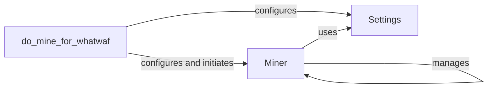

## Component Details

The Miner Integrator component automates the process of discovering new WAF signatures or payloads by integrating with external miner tools. It configures the mining process based on settings, installs necessary dependencies for the miner tool, executes the miner, and manages the output. The main flow involves setting up the environment, running the miner, and handling the results, ultimately expanding the tool's detection capabilities.

### Miner
The Miner class serves as the central component for managing the mining process. It handles the initialization of the mining environment, installation of dependencies required by the external miner tool, and the execution of the mining process itself. It also defines abstract methods for installation and execution, allowing for different miner implementations.
- **Related Classes/Methods**: `WhatWaf.lib.miner.Miner.__do_miner_install`, `WhatWaf.lib.miner.Miner.init`, `WhatWaf.lib.miner.Miner.main`
- **Source Files**: `WhatWaf.lib.miner.Miner`

### do_mine_for_whatwaf
This function is responsible for configuring and initiating the mining process specifically for WhatWaf. It retrieves settings, sets up the necessary parameters for the Miner, and then triggers the Miner to start the mining operation. It acts as the entry point for the mining functionality within WhatWaf.
- **Related Classes/Methods**: `WhatWaf.lib.settings.do_mine_for_whatwaf`
- **Source Files**: `WhatWaf.lib.settings`

### Settings
The Settings module stores and manages the configuration settings required for the mining process. It provides access to parameters such as the miner tool path, output directory, and other relevant configurations. These settings are used by other components to customize the mining operation.
- **Related Classes/Methods**: `WhatWaf.lib.settings`
- **Source Files**: `WhatWaf.lib.settings`