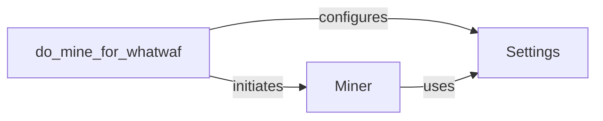

## Component Details

The Miner subsystem is responsible for discovering and adding new WAF signatures and payloads to the WhatWaf tool. It involves configuring mining parameters, initiating the mining process, and managing the settings required for mining operations. The subsystem leverages the Settings module for configuration and the Miner class for executing the mining process.

### Miner
The Miner class is responsible for managing the mining process. It handles the installation of necessary components, configures the mining environment, and executes the main mining loop to discover new WAF signatures and payloads. It interacts with the Settings module to retrieve configuration parameters and uses the mining functions to perform the actual mining.
- **Related Classes/Methods**: `WhatWaf.lib.miner.Miner`

### do_mine_for_whatwaf
The do_mine_for_whatwaf function serves as the entry point for initiating the mining process. It configures mining parameters based on the Settings module and calls the Miner class to start the mining operation. This function sets up the necessary environment and parameters before triggering the mining process.
- **Related Classes/Methods**: `WhatWaf.lib.settings`

### Settings
The Settings module stores configuration settings and parameters used by the Miner and other components. It provides a centralized location for managing mining-related configurations, such as mining parameters, file paths, and other settings required for the mining process. The Miner class and the do_mine_for_whatwaf function both rely on the Settings module to retrieve configuration information.
- **Related Classes/Methods**: `WhatWaf.lib.settings`
