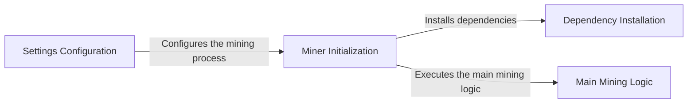

## Component Details

The Miner subsystem is responsible for discovering and integrating new WAF (Web Application Firewall) fingerprints into the WhatWaf tool. It involves configuring the mining process, installing necessary dependencies, and executing the main mining logic to identify new WAF signatures and detection methods. The mined fingerprints enhance WhatWaf's ability to accurately identify and bypass various WAF solutions.

### Settings Configuration
This component is responsible for loading and configuring the settings required for the WAF mining process. It reads settings from configuration files or command-line arguments and prepares them for use by other components, ensuring that the mining process is properly configured.
- **Source Reference**: `WhatWaf.lib.settings:do_mine_for_whatwaf`
  - *File*: `WhatWaf/lib/settings.py`

### Miner Initialization
This component initializes the Miner class, setting up the initial state of the miner. This includes loading configurations, establishing connections, and preparing data structures required for the mining process. It also handles the installation of any necessary dependencies.
- **Source Reference**: `WhatWaf.lib.miner.Miner:init`
  - *File*: `WhatWaf/lib/miner/Miner.py`

### Dependency Installation
This component handles the installation of external tools and libraries required for the WAF mining process. It ensures that all necessary dependencies are present and correctly configured before the mining process begins.
- **Source Reference**: `WhatWaf.lib.miner.Miner:__do_miner_install`
  - *File*: `WhatWaf/lib/miner/Miner.py`

### Main Mining Logic
This component represents the main entry point for the WAF mining process. It orchestrates the different steps involved in mining, such as sending requests, analyzing responses, and identifying WAF characteristics. It uses the configured settings and installed dependencies to perform the mining process.
- **Source Reference**: `WhatWaf.lib.miner.Miner:main`
  - *File*: `WhatWaf/lib/miner/Miner.py`