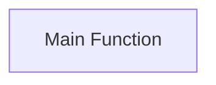

## Component Details

The WhatWaf tool's orchestration component is responsible for initiating and managing the WAF detection process. It starts with the `WhatWaf.trigger.main` function, which handles configuration loading, environment setup, and the overall workflow. The orchestration component then coordinates the interaction between various modules, including those responsible for target scanning, payload generation, request sending, and response analysis, to accurately identify the presence and type of WAF protection.

### Main Function
The main function serves as the entry point for the WAF detection process. It initializes configurations, sets up the environment, and starts the WAF detection workflow.
- **Related Classes/Methods**: `WhatWaf.trigger.main`