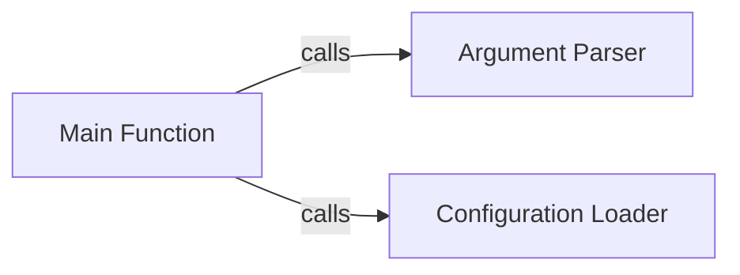

## Component Details

The WhatWaf tool's execution is orchestrated by the Orchestrator component, which serves as the entry point. It manages the overall workflow, coordinating the execution of other components to ensure a smooth and efficient scan process. The main function parses arguments, loads configurations, and initiates the scan based on the provided settings. The tool leverages modules for argument parsing, configuration loading, core scanning logic, and reporting to achieve its objectives.

### Main Function
The main function serves as the entry point for the WhatWaf tool. It is responsible for parsing command-line arguments, loading the configuration, and orchestrating the execution of the scan. It initializes the necessary components and manages the overall workflow.
- **Related Classes/Methods**: `WhatWaf.trigger.main:main`
- **Source Files**: `WhatWaf/trigger/main.py`

### Argument Parser
The argument parser component defines and parses command-line arguments using the argparse module. It specifies the available options and their expected values, providing a user-friendly interface for configuring the scan. It allows users to customize the scan's behavior through command-line flags.
- **Related Classes/Methods**: `WhatWaf.argument_parser:create_parser`
- **Source Files**: `WhatWaf/argument_parser.py`

### Configuration Loader
The configuration loader component loads the configuration settings from a specified file or uses default values if no file is provided. These settings dictate the behavior of the scan, such as the modules to be used and their specific configurations. It provides flexibility in configuring the scan through external configuration files.
- **Related Classes/Methods**: `WhatWaf.config_loader:load_config`
- **Source Files**: `WhatWaf/config_loader.py`