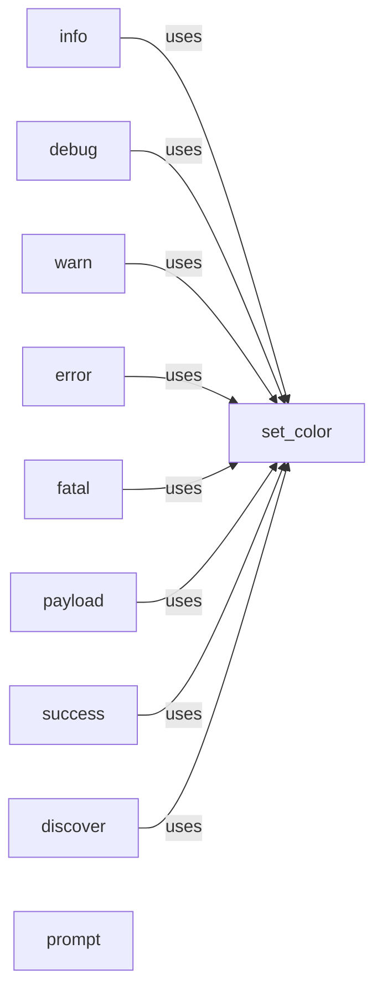

## Component Details

The Output Formatter component provides a set of functions to display messages with different levels of severity and types, such as info, debug, warning, error, fatal, payload, success, and discover. It uses ANSI escape codes to colorize the output, making it easier to distinguish between different types of messages. The component also includes a prompt function for user interaction, allowing the tool to request input from the user with specified options and default values. The main purpose of this component is to ensure that the tool's output is clear, concise, and easily understandable for the user.

### set_color
Sets the color of a given string based on the specified level. It uses ANSI escape codes to apply colors to the string.
- **Related Classes/Methods**: `WhatWaf.lib.formatter:set_color`

### info
Displays an informational message with a timestamp and a specific color.
- **Related Classes/Methods**: `WhatWaf.lib.formatter:info`

### debug
Displays a debugging message with a timestamp and a specific color.
- **Related Classes/Methods**: `WhatWaf.lib.formatter:debug`

### warn
Displays a warning message with a timestamp and a specific color. It has an option to display minor warnings.
- **Related Classes/Methods**: `WhatWaf.lib.formatter:warn`

### error
Displays an error message with a timestamp and a specific color.
- **Related Classes/Methods**: `WhatWaf.lib.formatter:error`

### fatal
Displays a fatal error message with a timestamp and a specific color.
- **Related Classes/Methods**: `WhatWaf.lib.formatter:fatal`

### payload
Displays a payload message with a specific color.
- **Related Classes/Methods**: `WhatWaf.lib.formatter:payload`

### success
Displays a success message with a specific color.
- **Related Classes/Methods**: `WhatWaf.lib.formatter:success`

### discover
Displays a discovery message with a timestamp and a specific color.
- **Related Classes/Methods**: `WhatWaf.lib.formatter:discover`

### prompt
Prompts the user for input with a message and a set of options. It allows specifying a default choice and checks if the user's choice is valid.
- **Related Classes/Methods**: `WhatWaf.lib.formatter:prompt`
