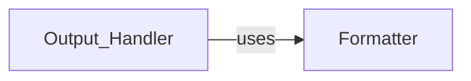

## Component Details

The Output Handler component is responsible for formatting and presenting the results of the WAF detection process. It leverages the Formatter module to ensure consistent output across different formats, such as console or file. The core functionality revolves around taking detection results and transforming them into a user-friendly representation, incorporating various message types like info, debug, warnings, errors, and payloads.

### Formatter
The Formatter component provides a set of functions for formatting output messages with different levels of severity. It centralizes the formatting logic for consistent output across the application, ensuring a uniform look and feel for all messages displayed to the user or written to a log file.
- **Related Classes/Methods**: `WhatWaf.lib.formatter` (full file reference), `WhatWaf.lib.formatter:info` (29:32), `WhatWaf.lib.formatter:debug` (35:38), `WhatWaf.lib.formatter:warn` (41:49), `WhatWaf.lib.formatter:error` (52:55), `WhatWaf.lib.formatter:fatal` (58:61), `WhatWaf.lib.formatter:payload` (64:67), `WhatWaf.lib.formatter:success` (70:73), `WhatWaf.lib.formatter:discover` (87:90)