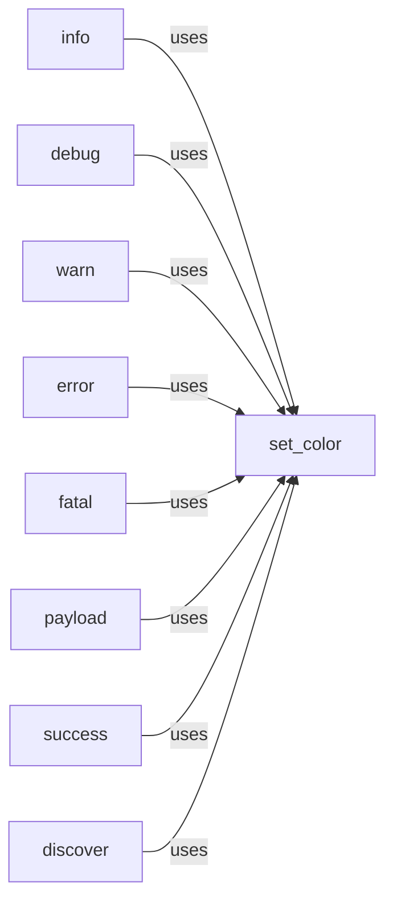

## Component Details

The Output Handler component in WhatWaf is responsible for formatting and displaying various types of messages to the user, including informational, debug, warning, error, success, and discovery messages. It uses ANSI escape codes to color-code the messages for better readability and to highlight important information. The component provides a consistent interface for presenting information to the user, making it easier to understand the program's state and any issues that may arise.

### set_color
Sets the color of a string using ANSI escape codes based on the specified level (info, debug, warn, error, fatal, payload, success, discover). It returns the colored string. This function encapsulates the ANSI escape code logic, making it easier to apply consistent coloring across different message types.
- **Related Classes/Methods**: `WhatWaf.lib.formatter:set_color` (8:26)

### info
Prints an informational message to the console, prepended with a timestamp and colored using ANSI escape codes. It leverages the `set_color` function to apply the appropriate color for informational messages.
- **Related Classes/Methods**: `WhatWaf.lib.formatter:info` (29:32)

### debug
Prints a debug message to the console, prepended with a timestamp and colored using ANSI escape codes. It uses the `set_color` function to format the debug message with the correct color.
- **Related Classes/Methods**: `WhatWaf.lib.formatter:debug` (35:38)

### warn
Prints a warning message to the console, prepended with a timestamp and colored using ANSI escape codes. It has a minor flag to change the color. It uses the `set_color` function to format the warning message.
- **Related Classes/Methods**: `WhatWaf.lib.formatter:warn` (41:49)

### error
Prints an error message to the console, prepended with a timestamp and colored using ANSI escape codes. It utilizes the `set_color` function to format the error message with the appropriate color.
- **Related Classes/Methods**: `WhatWaf.lib.formatter:error` (52:55)

### fatal
Prints a fatal error message to the console, prepended with a timestamp and colored using ANSI escape codes. It relies on the `set_color` function to format the fatal error message.
- **Related Classes/Methods**: `WhatWaf.lib.formatter:fatal` (58:61)

### payload
Prints a payload message to the console, colored using ANSI escape codes. It uses the `set_color` function to format the payload message.
- **Related Classes/Methods**: `WhatWaf.lib.formatter:payload` (64:67)

### success
Prints a success message to the console, prepended with a timestamp and colored using ANSI escape codes. It uses the `set_color` function to format the success message.
- **Related Classes/Methods**: `WhatWaf.lib.formatter:success` (70:73)

### discover
Prints a discovery message to the console, prepended with a timestamp and colored using ANSI escape codes. It uses the `set_color` function to format the discovery message.
- **Related Classes/Methods**: `WhatWaf.lib.formatter:discover` (87:90)