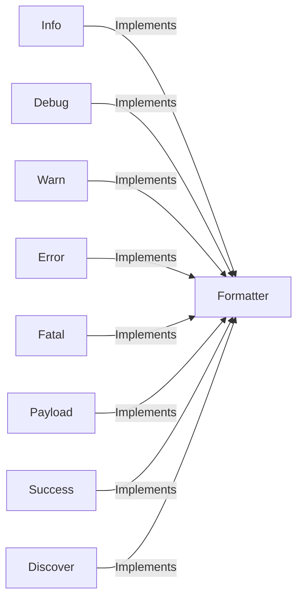

## Component Details

The Output Management component in WhatWaf provides a centralized and consistent way to format and display various types of messages to the user, including informational messages, debug details, warnings, errors, successful detections, and payload data. It ensures a clear and informative user experience by offering different formatting options tailored to the specific message type. The core functionality resides within the `WhatWaf.lib.formatter` module, which contains methods for each type of output.

### Formatter
The Formatter component is the central point for all output formatting in WhatWaf. It provides a set of methods for displaying different types of messages, such as informational messages, debug details, warnings, errors, successful detections, and payload data. Each method formats the message according to its type and prints it to the console.
- **Related Classes/Methods**: `WhatWaf.lib.formatter`

### Info
The Info component formats and prints informational messages to the user, providing general updates and status reports during the program's execution.
- **Related Classes/Methods**: `WhatWaf.lib.formatter:info`

### Debug
The Debug component formats and prints debugging messages, offering detailed information about the program's internal state and operations. These messages are typically intended for developers to aid in troubleshooting and debugging.
- **Related Classes/Methods**: `WhatWaf.lib.formatter:debug`

### Warn
The Warn component formats and prints warning messages, indicating potential issues or non-critical errors that may affect the program's behavior. These messages alert the user to potential problems without halting execution.
- **Related Classes/Methods**: `WhatWaf.lib.formatter:warn`

### Error
The Error component formats and prints error messages, signaling that something went wrong during the program's execution. These messages indicate that an operation failed and may require user intervention.
- **Related Classes/Methods**: `WhatWaf.lib.formatter:error`

### Fatal
The Fatal component formats and prints fatal error messages, indicating a critical failure that prevents the program from continuing. These messages signal a severe problem that requires immediate attention.
- **Related Classes/Methods**: `WhatWaf.lib.formatter:fatal`

### Payload
The Payload component formats and prints payload-related messages, displaying data being sent or received during network communication. This is useful for inspecting the contents of requests and responses.
- **Related Classes/Methods**: `WhatWaf.lib.formatter:payload`

### Success
The Success component formats and prints success messages, indicating that an operation completed successfully. These messages provide positive feedback to the user.
- **Related Classes/Methods**: `WhatWaf.lib.formatter:success`

### Discover
The Discover component formats and prints discovery messages, reporting newly found information or resources. This is often used to highlight newly identified vulnerabilities or configuration details.
- **Related Classes/Methods**: `WhatWaf.lib.formatter:discover`