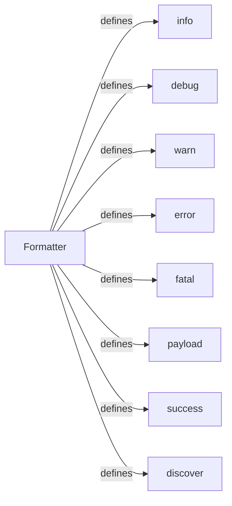

## Component Details

The Output and Logging component provides a centralized and consistent way to format and output messages with different severity levels, including informational, debug, warning, error, fatal, payload, success, and discovery messages. It ensures that all output is presented in a uniform and readable format, facilitating debugging, analysis, and monitoring of the WhatWaf application. The component is built around the `formatter` module, which defines functions for each severity level.

### Formatter
The Formatter module provides a set of functions for logging messages with different severity levels. It centralizes the formatting and output of log messages within the WhatWaf application.
- **Related Classes/Methods**: `WhatWaf.lib.formatter` (full file reference)

### info
Logs an informational message using the specified format.
- **Related Classes/Methods**: `WhatWaf.lib.formatter:info` (29:32)

### debug
Logs a debug message, typically used for detailed debugging information.
- **Related Classes/Methods**: `WhatWaf.lib.formatter:debug` (35:38)

### warn
Logs a warning message, indicating a potential issue or non-critical error.
- **Related Classes/Methods**: `WhatWaf.lib.formatter:warn` (41:49)

### error
Logs an error message, indicating a failure or problem that needs attention.
- **Related Classes/Methods**: `WhatWaf.lib.formatter:error` (52:55)

### fatal
Logs a fatal error message, indicating a critical failure that may lead to application termination.
- **Related Classes/Methods**: `WhatWaf.lib.formatter:fatal` (58:61)

### payload
Logs a payload message, typically used to display data or content being processed.
- **Related Classes/Methods**: `WhatWaf.lib.formatter:payload` (64:67)

### success
Logs a success message, indicating a successful operation or outcome.
- **Related Classes/Methods**: `WhatWaf.lib.formatter:success` (70:73)

### discover
Logs a discovery message, indicating a newly discovered resource or finding.
- **Related Classes/Methods**: `WhatWaf.lib.formatter:discover` (87:90)