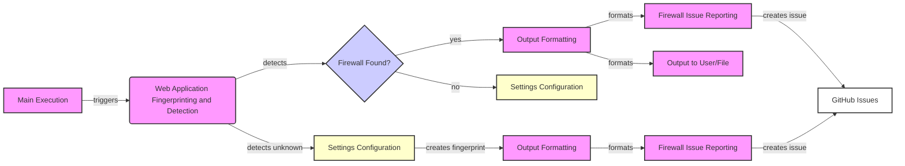

### Component Descriptions:

- **Main Execution**
  - *Description*: Orchestrates the entire scanning process.
  - *Interaction*: Triggers the Web Application Fingerprinting and Detection component.
  - *Source Files*: `repos.WhatWaf.trigger.main`

- **Web Application Fingerprinting and Detection**
  - *Description*: Sends malicious requests and analyzes responses to detect and fingerprint web application firewalls.
  - *Interaction*: Detects firewalls and interacts with the Output Formatting component if a firewall is found, or Settings Configuration if an unknown firewall is found.
  - *Source Files*: `repos.WhatWaf.lib.content`

- **Firewall Found?**
  - *Description*: Decision node to determine if a firewall was detected.
  - *Interaction*: Routes the process to Output Formatting if a firewall is found, or Settings Configuration if no firewall is found.
  - *Source Files*: N/A (Decision Node)

- **Output Formatting**
  - *Description*: Formats the results of the WAF detection process for display or file output.
  - *Interaction*: Receives detection results from Web Application Fingerprinting and Detection and formats them for the user, Firewall Issue Reporting, or file output.
  - *Source Files*: `repos.WhatWaf.lib.formatter`

- **Firewall Issue Reporting**
  - *Description*: Creates and submits issues to GitHub related to detected firewalls, especially unknown ones.
  - *Interaction*: Receives formatted output from Output Formatting and creates issues on GitHub.
  - *Source Files*: `repos.WhatWaf.lib.firewall_found`

- **Output to User/File**
  - *Description*: Outputs the formatted results to the user's console or a specified file.
  - *Interaction*: Receives formatted output from Output Formatting and displays it to the user or writes it to a file.
  - *Source Files*: `repos.WhatWaf.lib.settings` (writing to file)

- **GitHub Issues**
  - *Description*: External component representing the GitHub issue tracker.
  - *Interaction*: Receives issue creation requests from Firewall Issue Reporting.
  - *Source Files*: N/A (External Component)

- **Settings Configuration**
  - *Description*: Configures settings and creates fingerprints for unknown firewalls.
  - *Interaction*: Called when an unknown firewall is detected, creates a fingerprint, and then passes control to Output Formatting.
  - *Source Files*: `repos.WhatWaf.lib.settings`
