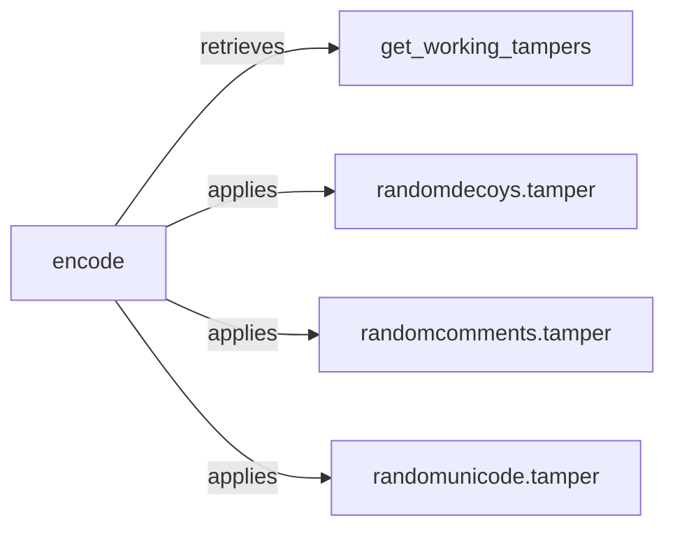

## Component Details

The Payload Generator component is responsible for creating and encoding malicious payloads designed to bypass WAF filters. It retrieves available tampers, applies them to the content, and encodes the result. The main flow involves selecting appropriate tampering techniques, applying these techniques to modify the original payload, and then encoding the tampered payload to further obfuscate it. This process ensures that a variety of payloads are generated to effectively test the target's security posture.

### get_working_tampers
This function retrieves a list of available tampers that can be applied to the content. It filters or selects tampers based on certain criteria or configurations, such as the type of vulnerability being tested or the specific WAF being targeted. The output of this function is a list of tamper functions that can be used to modify the payload.
- **Source Reference**: `WhatWaf.content:get_working_tampers`
  - *File*: `WhatWaf/content.py`

### encode
This function handles the encoding of the content before or after tampering. Encoding might involve URL encoding, base64 encoding, or other techniques to obfuscate the content and ensure that it is properly transmitted in HTTP requests. The encoding process helps to bypass WAF filters that might detect specific patterns in the raw payload.
- **Source Reference**: `WhatWaf.content:encode`
  - *File*: `WhatWaf/content.py`

### randomdecoys.tamper
This function implements a tampering technique that adds random decoy elements to the content. This is intended to confuse or bypass WAFs by introducing irrelevant data, making it harder for the WAF to identify malicious patterns. The decoy elements are inserted at random locations within the payload.
- **Source Reference**: `WhatWaf.content.tampers.randomdecoys:tamper`
  - *File*: `WhatWaf/content/tampers/randomdecoys.py`

### randomcomments.tamper
This function implements a tampering technique that adds random comments to the content. Similar to decoys, this aims to disrupt WAF pattern matching by inserting noise. The comments are inserted at random locations within the payload, making it harder for the WAF to identify malicious patterns.
- **Source Reference**: `WhatWaf.content.tampers.randomcomments:tamper`
  - *File*: `WhatWaf/content/tampers/randomcomments.py`

### randomunicode.tamper
This function implements a tampering technique that adds random Unicode characters to the content. This can potentially bypass WAFs that do not properly handle Unicode or have vulnerabilities related to Unicode processing. The Unicode characters are inserted at random locations within the payload.
- **Source Reference**: `WhatWaf.content.tampers.randomunicode:tamper`
  - *File*: `WhatWaf/content/tampers/randomunicode.py`