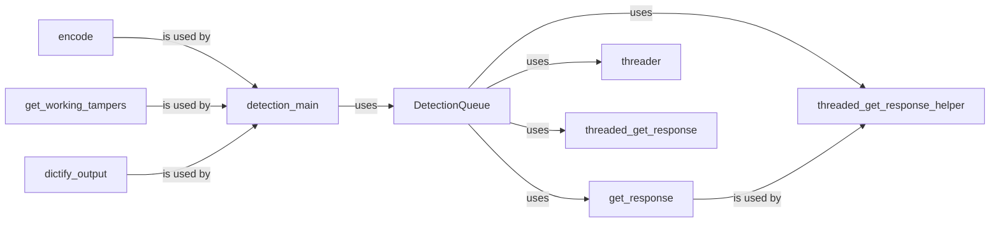

## Component Details

The Payload Handling and Analysis component is responsible for generating and sending malicious payloads to a target, receiving and analyzing the responses, and detecting potential vulnerabilities. It leverages a thread pool to send concurrent requests, improving efficiency. The component encodes payloads to bypass WAF filters, retrieves working tamper scripts to modify payloads, and formats the output into a dictionary for easy access and processing. The core logic resides within the `detection_main` function, which orchestrates the entire process.

### DetectionQueue
The DetectionQueue class manages a queue of HTTP requests to be sent to the target. It uses a thread pool to send these requests concurrently, improving performance. It stores the responses received from the target for later analysis. The class provides methods for adding requests to the queue and retrieving responses.
- **Related Classes/Methods**: `WhatWaf.content.DetectionQueue`

### get_response
The `get_response` function sends an HTTP request to the target server and returns the response. It handles the actual communication with the target, including setting headers and handling potential errors. This function is a key part of the process of interacting with the target and receiving information about its behavior.
- **Related Classes/Methods**: `WhatWaf.content.DetectionQueue:get_response`

### threader
The `threader` function creates and manages a pool of threads for sending HTTP requests concurrently. This improves performance by allowing multiple requests to be sent in parallel. The function waits for all threads to complete before returning, ensuring that all requests have been processed.
- **Related Classes/Methods**: `WhatWaf.content.DetectionQueue:threader`

### threaded_get_response_helper
The `threaded_get_response_helper` function is a helper function that is executed by each thread in the thread pool. It calls the `get_response` function to send an HTTP request and process the response. This function allows the `DetectionQueue` to send requests concurrently.
- **Related Classes/Methods**: `WhatWaf.content.DetectionQueue:threaded_get_response_helper`

### threaded_get_response
The `threaded_get_response` function adds requests to the queue for threaded processing. It takes the request parameters and adds them to the queue, which is then processed by the thread pool. This function is the main entry point for adding requests to the `DetectionQueue`.
- **Related Classes/Methods**: `WhatWaf.content.DetectionQueue:threaded_get_response`

### encode
The `encode` function encodes the request payload to bypass WAF filters. It applies various encoding techniques to obfuscate the payload, making it more difficult for WAFs to detect malicious content. This function is a crucial part of the process of evading WAFs.
- **Related Classes/Methods**: `WhatWaf.content:encode`

### get_working_tampers
The `get_working_tampers` function retrieves a list of working tamper scripts or functions that can be used to modify the request payload. These tamper scripts are used to further obfuscate the payload and bypass WAF filters. The function returns a list of tamper scripts that have been identified as being effective.
- **Related Classes/Methods**: `WhatWaf.content:get_working_tampers`

### dictify_output
The `dictify_output` function formats the output into a dictionary for easy access and processing. This function takes the raw output from the WAF detection process and converts it into a structured dictionary format, making it easier to analyze the results.
- **Related Classes/Methods**: `WhatWaf.content:dictify_output`

### detection_main
The `detection_main` function is the main function that orchestrates the WAF detection process. It calls other functions to encode payloads, send requests, and analyze responses. This function is the central point of control for the entire WAF detection process.
- **Related Classes/Methods**: `WhatWaf.content:detection_main`