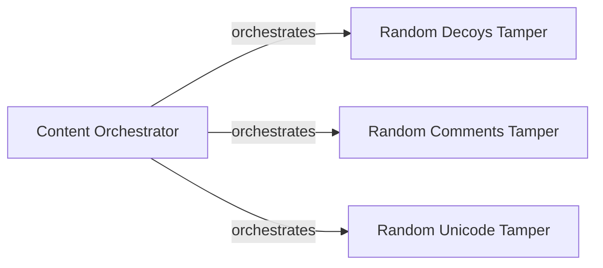

## Component Details

The Payload Injection and Tampering component is responsible for generating, modifying, and injecting payloads into the target URL to detect web application firewalls (WAFs). It leverages a library of tamper modules to obfuscate payloads and bypass WAF rules. The core logic resides in the `content` module, which orchestrates the encoding of payloads, selection of appropriate tampers, execution of the main detection logic, and formatting the output. The component interacts with tamper modules like `randomdecoys`, `randomcomments`, and `randomunicode` to modify the payloads before injection. The detection results are then passed to other components for further analysis and response handling.

### Content Orchestrator
The core module responsible for orchestrating the detection process. It handles encoding payloads, selecting appropriate tampers, executing the main detection logic, and formatting the output into a dictionary. It determines which tampers to use based on the provided configuration and the target URL.
- **Related Classes/Methods**: `WhatWaf.content` (full file reference), `WhatWaf.content:encode` (220:225), `WhatWaf.content:get_working_tampers` (238:330), `WhatWaf.content:dictify_output` (364:392), `WhatWaf.content:detection_main` (395:729)

### Random Decoys Tamper
A tamper module that adds random decoy parameters to the request payload to obfuscate the malicious intent and bypass WAFs. It generates random parameter names and values, appending them to the original payload.
- **Related Classes/Methods**: `WhatWaf.content.tampers.randomdecoys:tamper` (9:39)

### Random Comments Tamper
A tamper module that adds random comments to the request payload to confuse WAFs and evade detection. It inserts comments at various locations within the payload, disrupting the WAF's parsing logic.
- **Related Classes/Methods**: `WhatWaf.content.tampers.randomcomments:tamper` (9:21)

### Random Unicode Tamper
A tamper module that adds random Unicode characters to the request payload to bypass WAFs that may not properly handle Unicode encoding. It inserts Unicode characters at various locations within the payload, potentially causing parsing errors or misinterpretations by the WAF.
- **Related Classes/Methods**: `WhatWaf.content.tampers.randomunicode:tamper` (8:27)