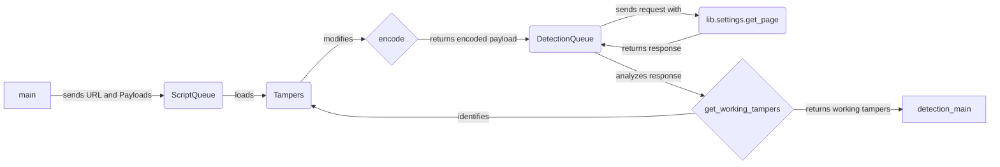

## Payload Management Component Overview

The `Payload Management` component is responsible for encoding and tampering payloads used for WAF detection. It aims to generate variations of the original payloads to bypass potential WAF rules and identify vulnerabilities.

### Data Flow Diagram

### Component Descriptions

*   **main**: The entry point of the application. It initializes the process by sending the URL and initial payloads to the `ScriptQueue`.
    *   **Source File**: `repos.WhatWaf.trigger.main`
*   **ScriptQueue**: Loads tamper scripts from the `lib.settings.TAMPERS_DIRECTORY`. It provides these scripts to the `encode` component.
    *   **Source File**: `repos.WhatWaf.content.ScriptQueue`
*   **Tampers**: Contains various tamper scripts (e.g., `randomdecoys`, `randomcomments`, `randomunicode`) that modify the payload to bypass WAF rules. It receives payloads from `encode` and returns the modified payloads.
    *   **Source Files**:
        *   `repos.WhatWaf.content.tampers.randomdecoys`
        *   `repos.WhatWaf.content.tampers.randomcomments`
        *   `repos.WhatWaf.content.tampers.randomunicode`
*   **encode**: Encodes the payload using a selected tamper script. It receives the original payload and a tamper script from `ScriptQueue`, applies the script, and returns the encoded payload to `DetectionQueue`.
    *   **Source File**: `repos.WhatWaf.content:encode`
*   **DetectionQueue**: Sends HTTP requests with the encoded payloads. It receives encoded payloads from `encode` and sends the requests using `lib.settings.get_page`. It then analyzes the responses.
    *   **Source File**: `repos.WhatWaf.content.DetectionQueue`
*   **lib.settings.get_page**: Fetches the content of a given URL. It's used by `DetectionQueue` to send HTTP requests and retrieve responses.
    *   **Source File**: `lib.settings.get_page`
*   **get_working_tampers**: Identifies tamper scripts that successfully bypass the WAF. It receives responses from `DetectionQueue`, analyzes them, and returns a set of working tamper scripts. These scripts are then used in subsequent requests.
    *   **Source File**: `repos.WhatWaf.content:get_working_tampers`
*   **detection_main**: Orchestrates the entire detection process. It receives the working tampers from `get_working_tampers` and uses them to refine the payloads for further detection attempts.
    *   **Source File**: `repos.WhatWaf.content:detection_main`