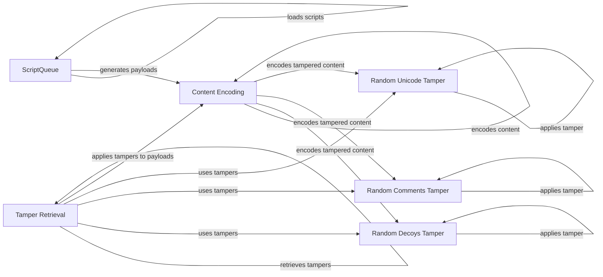

## Component Details

The Payload Manager is responsible for generating, encoding, and tampering with payloads used to probe for WAFs. It integrates with the Script Queue to load and manage scripts for dynamic payload generation and utilizes various tampering techniques to bypass firewall rules. It also interacts with encoding mechanisms to properly format the payloads and uses a variety of tampers to evade detection. The core flow involves loading scripts for payload generation, applying selected tampers to modify the payload, and encoding the final payload for use in probing.

### ScriptQueue
The ScriptQueue class manages the loading and organization of scripts from a specified directory. These scripts are used for dynamic payload generation, providing a flexible way to create various payloads based on external script definitions. It loads scripts from a directory and makes them available for payload generation.
- **Related Classes/Methods**: `WhatWaf.content.ScriptQueue` (23:55), `WhatWaf.content.ScriptQueue:load_scripts` (38:55)

### Content Encoding
The `encode` function handles the encoding of content, ensuring it is properly formatted for transmission or storage. This includes character encoding and other transformations to ensure the payload is correctly interpreted by the target system.
- **Related Classes/Methods**: `WhatWaf.content:encode` (220:225)

### Tamper Retrieval
The `get_working_tampers` function retrieves a list of active tamper functions. These tampers are used to modify the content to bypass security filters. It dynamically selects and returns the tampers that are enabled for use.
- **Related Classes/Methods**: `WhatWaf.content:get_working_tampers` (238:330)

### Random Decoys Tamper
The `randomdecoys` tamper adds random decoy elements to the content, obfuscating it to evade detection by security systems. It inserts random, irrelevant data to confuse pattern-matching filters.
- **Related Classes/Methods**: `WhatWaf.content.tampers.randomdecoys:tamper` (9:39)

### Random Comments Tamper
The `randomcomments` tamper injects random comments into the content, aiming to obfuscate it and evade detection. It adds comments at various points in the payload to disrupt parsing and detection mechanisms.
- **Related Classes/Methods**: `WhatWaf.content.tampers.randomcomments:tamper` (9:21)

### Random Unicode Tamper
The `randomunicode` tamper introduces random Unicode characters into the content, potentially bypassing filters that are not Unicode-aware. It inserts Unicode characters to exploit encoding vulnerabilities.
- **Related Classes/Methods**: `WhatWaf.content.tampers.randomunicode:tamper` (8:27)