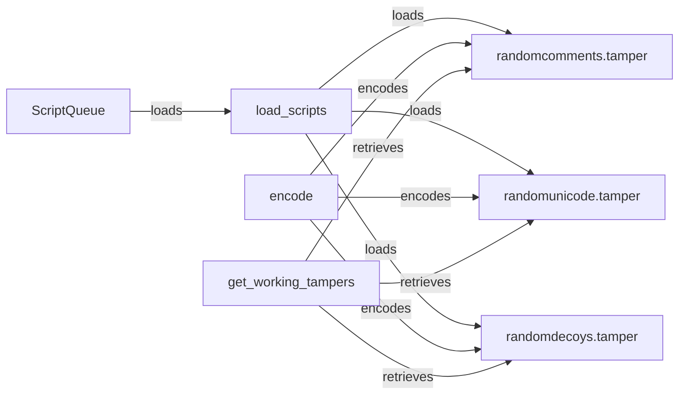

## Component Details

The Payload Manager orchestrates the creation and manipulation of payloads for security testing. It begins by loading tamper scripts using the ScriptQueue, which are then used to modify and encode the base payload. The encode function prepares the data, and available tamper scripts are retrieved to apply various obfuscation techniques. These techniques, such as adding random comments, Unicode characters, or decoy data, aim to evade WAF detection. The Payload Manager ensures that the payload is properly formatted and encoded before being sent to the target for testing.

### ScriptQueue
The ScriptQueue is responsible for managing and organizing tamper scripts. It loads available scripts from a specified source, making them accessible for payload manipulation. It initializes the tampering techniques that can be used to evade WAF detection.
- **Related Classes/Methods**: `WhatWaf.content.ScriptQueue`

### load_scripts
The load_scripts function is part of the ScriptQueue and is responsible for loading tamper scripts from a specified source. It makes these scripts available for use in modifying payloads.
- **Related Classes/Methods**: `WhatWaf.content.ScriptQueue:load_scripts`

### encode
The encode function is responsible for encoding the input data using a specific encoding scheme. This prepares the data for tampering and WAF evasion, ensuring it is properly formatted for testing.
- **Related Classes/Methods**: `WhatWaf.content:encode`

### get_working_tampers
The get_working_tampers function retrieves a list of available and active tamper scripts. It filters these scripts based on configuration and availability, providing a set of usable techniques for payload manipulation.
- **Related Classes/Methods**: `WhatWaf.content:get_working_tampers`

### randomcomments.tamper
The randomcomments.tamper script applies random comments to the input data. This technique aims to bypass WAFs by injecting harmless comments into the payload, obfuscating the malicious content.
- **Related Classes/Methods**: `WhatWaf.content.tampers.randomcomments:tamper`

### randomunicode.tamper
The randomunicode.tamper script injects random Unicode characters into the input data. This technique is used to evade WAFs by obfuscating the payload with non-standard characters.
- **Related Classes/Methods**: `WhatWaf.content.tampers.randomunicode:tamper`

### randomdecoys.tamper
The randomdecoys.tamper script adds random decoy code or data to the input. This technique aims to confuse WAFs by inserting irrelevant information into the payload, making it harder to detect malicious content.
- **Related Classes/Methods**: `WhatWaf.content.tampers.randomdecoys:tamper`
