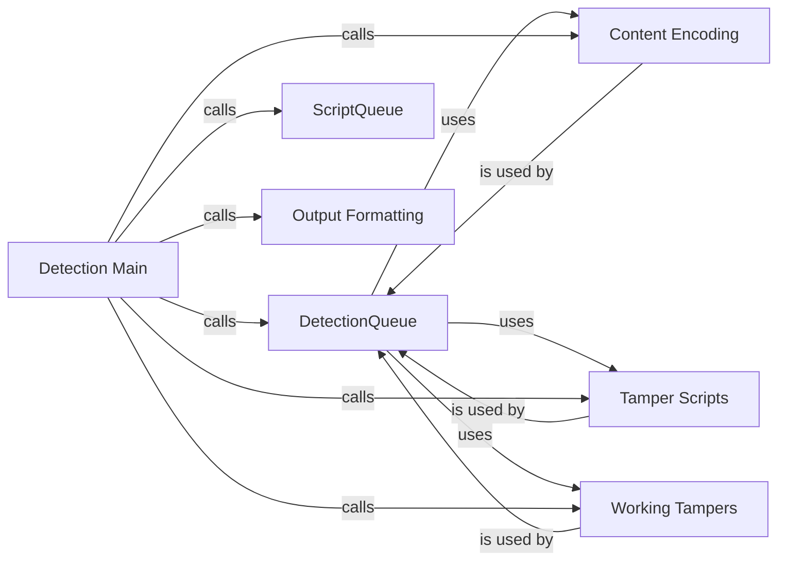

## Component Details

The Payload Manager is responsible for generating, encoding, and tampering with payloads to detect Web Application Firewalls (WAFs). It orchestrates the loading of scripts for payload generation, manages a queue of detections, and applies various tampering techniques to bypass firewalls. The core functionality involves crafting and manipulating payloads, sending requests, receiving responses, and formatting the output for analysis.

### DetectionQueue
The DetectionQueue manages the sending of requests and receiving of responses, potentially in a threaded manner. It handles the queueing of requests, concurrent execution using threads, and retrieval of responses, playing a central role in managing the detection process.
- **Related Classes/Methods**: `WhatWaf.content.DetectionQueue:get_response` (82:142), `WhatWaf.content.DetectionQueue:threader` (144:149), `WhatWaf.content.DetectionQueue:threaded_get_response_helper` (151:190), `WhatWaf.content.DetectionQueue:threaded_get_response` (192:217)

### ScriptQueue
The ScriptQueue is responsible for loading scripts, likely used for defining the payloads or logic for the detection process. It initializes and manages the scripts that will be used during the detection phase.
- **Related Classes/Methods**: `WhatWaf.content.ScriptQueue:load_scripts` (38:55)

### Content Encoding
The `encode` function is responsible for encoding the content of the requests. This might involve applying various encoding schemes to bypass WAF filters or to ensure proper formatting of the request.
- **Related Classes/Methods**: `WhatWaf.content:encode` (220:225)

### Tamper Scripts
The tamper scripts modify request payloads to evade WAF detection. They implement different tampering techniques such as adding random decoys, comments, or unicode characters.
- **Related Classes/Methods**: `WhatWaf.content.tampers.randomdecoys:tamper` (9:39), `WhatWaf.content.tampers.randomcomments:tamper` (9:21), `WhatWaf.content.tampers.randomunicode:tamper` (8:27)

### Working Tampers
The `get_working_tampers` function retrieves the available tamper scripts that can be applied to the request payloads. It likely filters or selects the appropriate tampers based on the specific WAF or target being tested.
- **Related Classes/Methods**: `WhatWaf.content:get_working_tampers` (238:330)

### Output Formatting
The `dictify_output` function formats the output of the detection process into a dictionary. This allows for easy access and manipulation of the results.
- **Related Classes/Methods**: `WhatWaf.content:dictify_output` (364:392)

### Detection Main
The `detection_main` function orchestrates the entire detection process. It calls other functions to load scripts, encode content, apply tampers, send requests, and format the output.
- **Related Classes/Methods**: `WhatWaf.content:detection_main` (395:729)