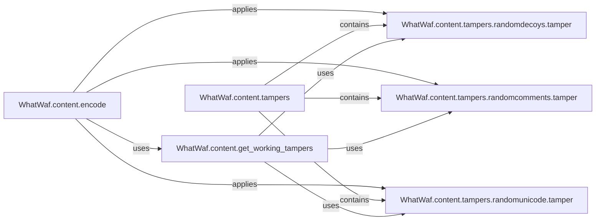

## Component Details

The Payload Manipulation component is responsible for encoding and tampering with the request payload to bypass Web Application Firewall (WAF) detection. It encodes the payload using various methods and applies a series of tamper scripts to modify the payload's structure and content. The component retrieves a list of active tamper scripts and applies them sequentially to the payload. This process enhances the tool's ability to detect WAFs even when they are actively trying to block malicious requests.

### WhatWaf.content.encode
This component encodes the input content using various encoding schemes and applies tamper scripts to evade WAF detection. It orchestrates the process of retrieving active tamper scripts and applying them to the payload.
- **Related Classes/Methods**: `WhatWaf.content`

### WhatWaf.content.get_working_tampers
This component retrieves a list of tamper scripts that are currently enabled and considered 'working'. It manages the available tamper scripts and their status, determining which scripts should be applied to the payload.
- **Related Classes/Methods**: `WhatWaf.content`

### WhatWaf.content.tampers
This module serves as a container for various tamper scripts. It provides a way to extend the tampering capabilities of WhatWaf by adding new scripts.
- **Related Classes/Methods**: `WhatWaf.content.tampers`

### WhatWaf.content.tampers.randomdecoys.tamper
This tamper script adds random decoy parameters to the request. This aims to confuse the WAF by introducing irrelevant data, making it harder to identify malicious patterns.
- **Related Classes/Methods**: `WhatWaf.content.tampers.randomdecoys`

### WhatWaf.content.tampers.randomcomments.tamper
This tamper script inserts random comments into the request. This attempts to bypass WAF rules that might be filtering specific patterns by obscuring the payload with comments.
- **Related Classes/Methods**: `WhatWaf.content.tampers.randomcomments`

### WhatWaf.content.tampers.randomunicode.tamper
This tamper script introduces random Unicode characters into the request. This aims to exploit potential vulnerabilities in WAF's Unicode handling, potentially bypassing filters that don't properly handle Unicode.
- **Related Classes/Methods**: `WhatWaf.content.tampers.randomunicode`