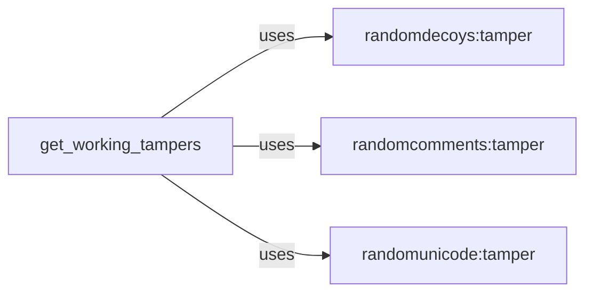

## Component Details

The Payload Manipulation subsystem focuses on providing tamper scripts to modify payloads, aiming to evade Web Application Firewall (WAF) detection. It includes functionalities to add random decoys, inject comments, and encode parts of the request using Unicode characters. The `get_working_tampers` component retrieves a list of active tamper scripts, which are then used to modify the request payload. The core of this subsystem lies in the individual tamper scripts (`randomdecoys`, `randomcomments`, `randomunicode`), each implementing a specific technique to obfuscate the payload.

### get_working_tampers
This component retrieves a list of working tamper scripts. It filters available tamper scripts based on criteria like compatibility and successful execution to provide a set of tampers that can be used effectively. It acts as a central point for selecting appropriate tamper scripts for a given request.
- **Related Classes/Methods**: ``WhatWaf.content:get_working_tampers` (0:0)`

### randomdecoys:tamper
This tamper script adds random decoy parameters to the request to obfuscate the actual parameters and make it harder for a WAF to identify malicious patterns. The `tamper` function modifies the request by adding these decoy parameters.
- **Related Classes/Methods**: ``WhatWaf.content.tampers.randomdecoys:tamper` (3:6)`

### randomcomments:tamper
This tamper script injects random comments into the request to confuse the WAF by adding noise and making it more difficult to parse the request and identify malicious content. The `tamper` function modifies the request by inserting these comments.
- **Related Classes/Methods**: ``WhatWaf.content.tampers.randomcomments:tamper` (3:6)`

### randomunicode:tamper
This tamper script encodes parts of the request using random Unicode characters. This can help bypass WAFs that rely on simple string matching or character whitelists. The `tamper` function identifies parts of the request that can be Unicode-encoded and applies the encoding.
- **Related Classes/Methods**: ``WhatWaf.content.tampers.randomunicode:tamper` (3:6)`