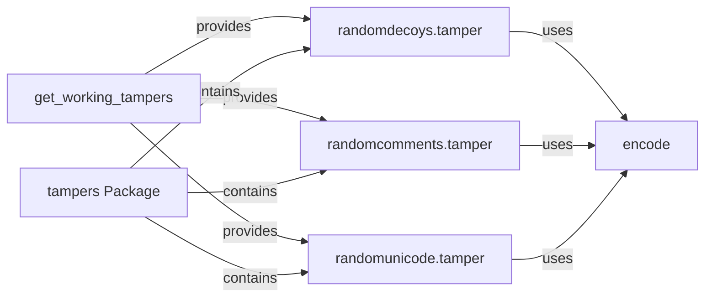

## Component Details

The Payload Tamperer component is responsible for modifying payloads to evade Web Application Firewalls (WAFs). It achieves this by applying various encoding and obfuscation techniques to the original payload. The main flow involves retrieving a list of available tamper functions, applying these functions to the payload, and encoding the modified payload. The purpose is to enhance the tool's ability to detect firewalls by bypassing their detection mechanisms.

### encode
Encodes a given string using a specified encoding method. This function is a core utility for preparing payloads in different formats for WAF testing. It supports various encoding schemes to bypass WAF filters.
- **Related Classes/Methods**: `WhatWaf.content:encode`
- **Source Files**: `WhatWaf/content.py`

### get_working_tampers
Retrieves a list of available tamper functions that can be applied to a string. This function is responsible for managing and providing access to the different tampering techniques. It dynamically loads and filters tamper functions based on certain criteria.
- **Related Classes/Methods**: `WhatWaf.content:get_working_tampers`
- **Source Files**: `WhatWaf/content.py`

### randomdecoys.tamper
A tamper function that adds random decoy characters to a string. This technique aims to bypass WAFs by obfuscating the original payload with irrelevant characters. It inserts random characters at various points in the payload.
- **Related Classes/Methods**: `WhatWaf.content.tampers.randomdecoys:tamper`
- **Source Files**: `WhatWaf/content/tampers/randomdecoys.py`

### randomcomments.tamper
A tamper function that adds random comments to a string. Similar to random decoys, this technique attempts to bypass WAFs by inserting comments that do not affect the payload's functionality but can confuse the WAF. It adds HTML-style comments within the payload.
- **Related Classes/Methods**: `WhatWaf.content.tampers.randomcomments:tamper`
- **Source Files**: `WhatWaf/content/tampers/randomcomments.py`

### randomunicode.tamper
A tamper function that adds random unicode characters to a string. This technique aims to bypass WAFs by using unicode characters that are semantically equivalent but may not be properly processed by the WAF. It inserts unicode characters that are visually similar to ASCII characters.
- **Related Classes/Methods**: `WhatWaf.content.tampers.randomunicode:tamper`
- **Source Files**: `WhatWaf/content/tampers/randomunicode.py`

### tampers Package
The tampers package groups together different tampering techniques. It provides a way to organize and manage the various tamper functions. It contains modules for random decoys, random comments, and random unicode characters.
- **Related Classes/Methods**: `WhatWaf.content.tampers`
- **Source Files**: `WhatWaf/content/tampers/__init__.py`, `WhatWaf/content/tampers/randomunicode.py`, `WhatWaf/content/tampers/randomcomments.py`, `WhatWaf/content/tampers/randomdecoys.py`