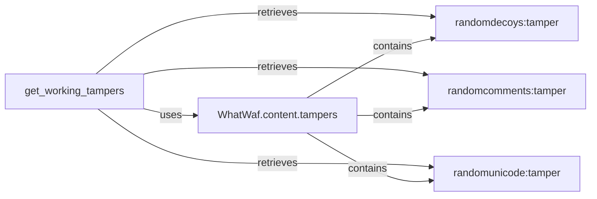

## Component Details

The Payload Tampering subsystem focuses on modifying web request payloads to evade Web Application Firewalls (WAFs). It provides a collection of tamper scripts that alter the structure and content of requests, using techniques like adding random decoys, comments, and unicode characters. The `get_working_tampers` function dynamically retrieves these tamper scripts, making them available for use in the WhatWaf tool.

### get_working_tampers
This function dynamically imports and retrieves a list of available tamper scripts from the `WhatWaf.content.tampers` module. It iterates through the files in the `tampers` directory, imports them as modules, and extracts the `tamper` function from each. These tamper functions are then returned as a list, ready to be applied to modify web requests.
- **Related Classes/Methods**: `WhatWaf.content:get_working_tampers` (238:330)

### randomdecoys:tamper
This function implements a tamper script that adds random decoy parameters to a web request. It generates random key-value pairs and inserts them into the request's GET or POST parameters, potentially obfuscating the original request and evading certain types of web application firewalls (WAFs).
- **Related Classes/Methods**: `WhatWaf.content.tampers.randomdecoys:tamper` (9:39)

### randomcomments:tamper
This function implements a tamper script that adds random comments to a web request. It inserts randomly generated comments within the request's GET or POST parameters, potentially obfuscating the original request and evading certain types of web application firewalls (WAFs).
- **Related Classes/Methods**: `WhatWaf.content.tampers.randomcomments:tamper` (9:21)

### randomunicode:tamper
This function implements a tamper script that adds random unicode characters to a web request. It inserts randomly generated unicode characters within the request's GET or POST parameters, potentially obfuscating the original request and evading certain types of web application firewalls (WAFs).
- **Related Classes/Methods**: `WhatWaf.content.tampers.randomunicode:tamper` (8:27)

### WhatWaf.content.tampers
This module serves as a container for various tamper scripts. It is a directory that groups together different tampering techniques, each implemented as a separate Python file containing a `tamper` function.
- **Related Classes/Methods**: `WhatWaf.content.tampers` (full file reference)