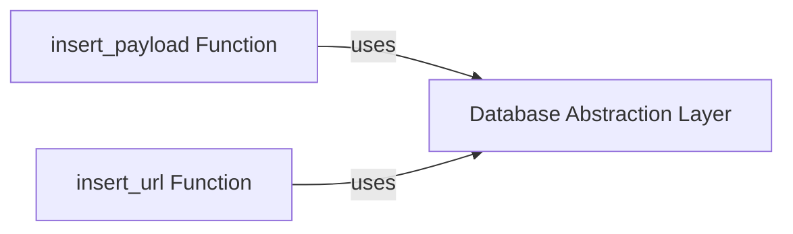

## Component Details

The Payload and URL Database Manager is responsible for handling interactions with the database, specifically inserting and managing payloads and URLs. It provides an abstraction layer for database operations, ensuring data persistence and efficient retrieval. The manager encapsulates the database connection and provides methods for inserting and retrieving data related to payloads and URLs, allowing the application to track and reuse them across multiple scans.

### Database Abstraction Layer
This component provides an abstraction layer for interacting with the database. It encapsulates the database connection details and offers a set of methods for performing common database operations, such as inserting and retrieving data. This abstraction simplifies database interactions and promotes code reusability.
- **Related Classes/Methods**: `WhatWaf.lib.database` (0:1000)

### insert_payload Function
This function is responsible for inserting payload data into the database. It takes payload information as input, including the payload content and any associated metadata, and stores it in the appropriate database table. It utilizes the Database Abstraction Layer to perform the actual database insertion.
- **Related Classes/Methods**: `WhatWaf.lib.database:insert_payload` (54:72)

### insert_url Function
This function is responsible for inserting URL data into the database. It takes URL information as input, including the URL string and any associated metadata, and stores it in the appropriate database table. It utilizes the Database Abstraction Layer to perform the actual database insertion.
- **Related Classes/Methods**: `WhatWaf.lib.database:insert_url` (75:124)