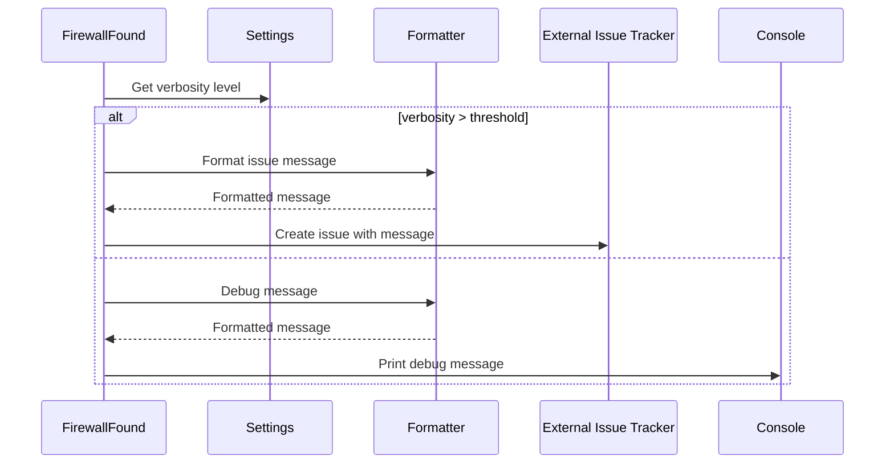

## Reporting & Output Component Overview

This component is responsible for formatting and displaying information to the user, as well as creating issues when firewalls are detected.

### Class Diagram

```mermaid
classDiagram
    class Formatter {
        +info(message)
        +debug(message)
        +warn(message)
        +error(message)
    }
    class FirewallFound {
        +request_issue_creation(firewall_name, url)
        +request_firewall_issue_creation(firewall_name, url)
    }
    class Settings {
        +verbosity
    }
    FirewallFound -- "uses" --> Formatter : formats output
    FirewallFound -- "uses" --> Settings : checks verbosity
```

### Sequence Diagram



### Component Descriptions

**Formatter**

*   Description: Handles output formatting to the console or other output streams. It provides methods for displaying information, warnings, errors, and other messages with different verbosity levels and colors.
*   Responsibilities: Formatting messages for display, setting colors based on message type.
*   Interactions: Used by `FirewallFound` to format messages before displaying them.
*   Source files: `repos.WhatWaf.lib.formatter`

**FirewallFound**

*   Description: Deals with the detection of firewalls and the creation of corresponding issues or reports. It likely interacts with external issue tracking systems or reporting mechanisms to notify users about detected firewalls.
*   Responsibilities: Detecting firewalls, creating issue reports, interacting with issue tracking systems.
*   Interactions: Uses `Formatter` to format messages, uses `Settings` to determine verbosity level.
*   Source files: `repos.WhatWaf.lib.firewall_found`

**Settings**

*   Description: Manages the configuration of the WhatWaf tool, including verbosity levels.
*   Responsibilities: Providing configuration data, managing verbosity level.
*   Interactions: Used by `FirewallFound` to check the current verbosity level.
*   Source files: `repos.WhatWaf.lib.settings`
