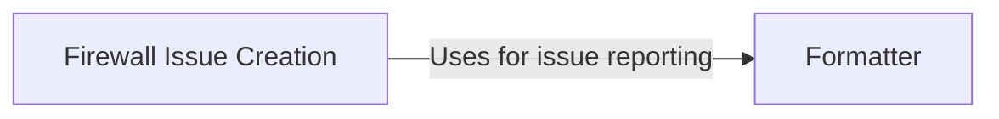

## Component Details

The Reporting and Logging component is responsible for providing a consistent and informative output of messages, including information, debug, warning, and error messages. It also manages the reporting of identified firewalls by creating issues in a vulnerability management or ticketing system. The component centralizes formatting logic and issue reporting, ensuring that all messages and reports are presented in a standardized manner.

### Formatter
The Formatter component provides a set of functions for formatting output, including informational messages, debug messages, warnings, and errors. It centralizes the formatting logic for the application, ensuring consistency across all messages.
- **Related Classes/Methods**: ``WhatWaf.lib.formatter:info` (13:16)`, ``WhatWaf.lib.formatter:debug` (18:21)`, ``WhatWaf.lib.formatter:warn` (23:26)`, ``WhatWaf.lib.formatter:error` (28:31)`

### Firewall Issue Creation
This component is responsible for creating firewall issues. It interacts with a vulnerability management system or ticketing system to report detected firewalls, ensuring that security teams are notified of potential vulnerabilities.
- **Related Classes/Methods**: ``WhatWaf.lib.firewall_found:request_firewall_issue_creation` (34:42)`