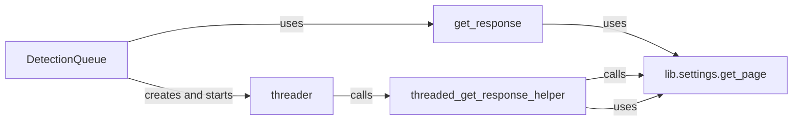

## Component Details

The WhatWaf Request Dispatcher subsystem is responsible for managing and executing HTTP requests to detect Web Application Firewalls (WAFs). It initializes a queue of requests, dispatches them concurrently using threads, retrieves responses, and analyzes them for WAF detection. The core components work together to efficiently scan the target and identify potential WAFs.

### DetectionQueue
The DetectionQueue manages the queue of HTTP requests to be sent to the target and analyzes the responses to detect WAFs. It uses threads to send requests concurrently, improving efficiency. It initializes with a URL, payloads, and various options like agent, proxy, and verbosity.
- **Related Classes/Methods**: `WhatWaf.content.detection_main`

### get_response
Sends an HTTP request and retrieves the response. It constructs the URL with the payload, sends the request using `lib.settings.get_page`, and returns the response tuple (status, html, headers). It handles potential network errors and saves fingerprints if enabled.
- **Related Classes/Methods**: `WhatWaf.content.detection_main`

### threader
Manages the threads used to send HTTP requests concurrently. It retrieves URLs and payloads from the `threading_queue` and calls `threaded_get_response_helper` to process them.
- **Related Classes/Methods**: `WhatWaf.content.detection_main`

### threaded_get_response_helper
A helper function that is executed by each thread. It calls `lib.settings.get_page` to send the HTTP request and process the response. It also handles potential network errors and saves fingerprints if enabled.
- **Related Classes/Methods**: `WhatWaf.content.detection_main`

### lib.settings.get_page
A utility function responsible for making the actual HTTP request and retrieving the response. It handles setting the user agent, proxy, headers, and timeout.
- **Related Classes/Methods**: `WhatWaf.content.detection_main`
