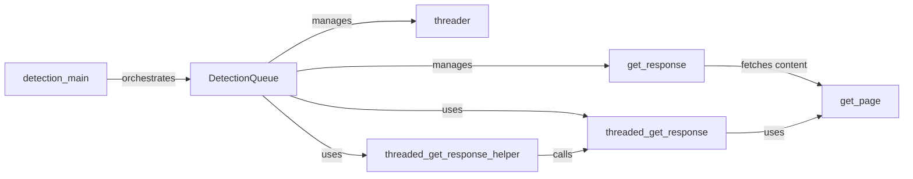

## Component Details

The Request Handler component orchestrates the WAF detection process by managing a queue of HTTP requests, dispatching them to threads for concurrent execution, and analyzing the responses to identify potential Web Application Firewalls (WAFs). It initializes the detection process, configures requests based on provided payloads, and manages the concurrent execution of these requests to efficiently analyze the target URL. The component aggregates the responses and determines if a WAF is present based on the analysis of the HTTP responses.

### DetectionQueue
The DetectionQueue component manages a queue of HTTP requests, distributing them across multiple threads for concurrent processing. It's responsible for creating and managing threads, assigning tasks to them, and collecting the responses. This component enhances efficiency by allowing multiple requests to be processed simultaneously.
- **Related Classes/Methods**: `WhatWaf.content.DetectionQueue.DetectionQueue`, `WhatWaf.content.DetectionQueue:get_response`, `WhatWaf.content.DetectionQueue:threader`, `WhatWaf.content.DetectionQueue:threaded_get_response_helper`, `WhatWaf.content.DetectionQueue:threaded_get_response`
- **Source Files**: `WhatWaf/content/DetectionQueue.py`

### get_response
The `get_response` component is responsible for retrieving the HTTP response for a given request. It utilizes the `get_page` function to fetch the content from the target URL and then processes the response to identify potential WAFs based on the response headers and content.
- **Related Classes/Methods**: `WhatWaf.content.DetectionQueue:get_response`
- **Source Files**: `WhatWaf/content/DetectionQueue.py`

### threader
The `threader` component manages the creation and execution of threads for concurrent HTTP request processing. It initializes a pool of threads and assigns them the task of fetching and processing HTTP responses, enabling parallel execution of requests to improve performance.
- **Related Classes/Methods**: `WhatWaf.content.DetectionQueue:threader`
- **Source Files**: `WhatWaf/content/DetectionQueue.py`

### threaded_get_response_helper
The `threaded_get_response_helper` component serves as a helper function executed by each thread. It calls the `threaded_get_response` function to retrieve the HTTP response within the thread's context and then processes the response to identify potential WAFs.
- **Related Classes/Methods**: `WhatWaf.content.DetectionQueue:threaded_get_response_helper`
- **Source Files**: `WhatWaf/content/DetectionQueue.py`

### threaded_get_response
The `threaded_get_response` component fetches the HTTP response within a thread. It calls the `get_page` function to retrieve the content from the target URL and handles any exceptions that may occur during the process. This component ensures that each thread can independently fetch and process responses.
- **Related Classes/Methods**: `WhatWaf.content.DetectionQueue:threaded_get_response`
- **Source Files**: `WhatWaf/content/DetectionQueue.py`

### detection_main
The `detection_main` component is the main function that orchestrates the entire WAF detection process. It initializes the `DetectionQueue`, configures the requests based on the provided payloads, and starts the detection process. This component serves as the entry point for the WAF detection functionality.
- **Related Classes/Methods**: `WhatWaf.content:detection_main`
- **Source Files**: `WhatWaf/content.py`

### get_page
The `get_page` component is responsible for fetching the content of a given URL. It uses a library like `requests` to send the HTTP request and retrieve the response. This component handles the actual network communication to retrieve the content from the target URL.
- **Related Classes/Methods**: `WhatWaf.lib.settings:get_page`
- **Source Files**: `WhatWaf/lib/settings.py`