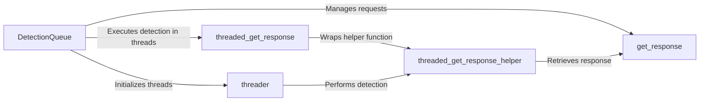

## Component Details

The Request Handler component is responsible for managing and executing HTTP requests to a target server. It utilizes a thread pool to handle concurrent requests, improving efficiency. The core functionality involves retrieving responses from the server, managing a queue of requests, and providing helper functions for interacting with the target. This component is crucial for gathering data used in WAF detection.

### DetectionQueue
The DetectionQueue class manages a queue of URLs to be scanned and uses a thread pool to concurrently retrieve HTTP responses. It orchestrates the process of sending requests, receiving responses, and handling any exceptions that may occur during the process. The queue ensures that requests are processed in an orderly manner, while the thread pool allows for efficient utilization of system resources.
- **Related Classes/Methods**: `WhatWaf.content.DetectionQueue`

### get_response
The `get_response` method is responsible for sending an HTTP request to a specified URL and retrieving the response. It handles setting up the request, sending it to the server, and processing the response. This method is a fundamental part of the request handling process, as it directly interacts with the target server.
- **Related Classes/Methods**: `WhatWaf.content.DetectionQueue:get_response`

### threader
The `threader` method initializes and starts a pool of threads. Each thread is responsible for executing the `threaded_get_response` method, which retrieves HTTP responses and performs detection tasks. This method manages the concurrent execution of requests, improving the overall speed of the scanning process.
- **Related Classes/Methods**: `WhatWaf.content.DetectionQueue:threader`

### threaded_get_response
The `threaded_get_response` method serves as a wrapper for the `threaded_get_response_helper` method. It handles any exceptions that may occur during the execution of the helper method. This ensures that the program does not crash if an error occurs during the request handling process.
- **Related Classes/Methods**: `WhatWaf.content.DetectionQueue:threaded_get_response`

### threaded_get_response_helper
The `threaded_get_response_helper` method is the core function executed by each thread in the thread pool. It retrieves a URL from the queue, sends an HTTP request to the URL, retrieves the response, and performs detection tasks on the response. This method is the workhorse of the request handling process, as it directly interacts with the target server and performs the necessary analysis.
- **Related Classes/Methods**: `WhatWaf.content.DetectionQueue:threaded_get_response_helper`