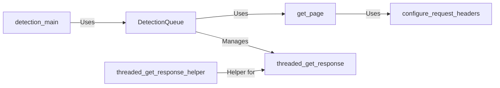

## Component Details

The Request Handling subsystem manages the process of sending HTTP requests to a target web server and handling the responses to detect Web Application Firewalls (WAFs). It utilizes a queue to manage detection tasks, employs threading for asynchronous request processing to improve performance, and configures request headers to potentially bypass WAF protections or trigger specific rules. The core components work together to efficiently and effectively identify the presence and type of WAFs.

### DetectionQueue
The DetectionQueue component manages a queue of detection tasks, distributing them across multiple threads for concurrent processing. It retrieves HTTP responses using the `get_response` method, manages threads with the `threader` method, and utilizes `threaded_get_response` and `threaded_get_response_helper` for asynchronous request handling. This component is central to managing the workload and collecting results efficiently.
- **Related Classes/Methods**: `WhatWaf.content.DetectionQueue`

### detection_main
The `detection_main` component serves as the entry point for the WAF detection process. It orchestrates the overall flow, including setting up the `DetectionQueue` and initiating the analysis. It configures request headers and uses the `DetectionQueue` to manage the requests, ensuring the detection process is properly initialized and executed.
- **Related Classes/Methods**: `WhatWaf.content:detection_main`

### get_page
The `get_page` component is responsible for sending HTTP requests to the target web server and retrieving the responses. It handles the actual network communication, using the `configure_request_headers` component to set up the request headers before sending the request. This component is crucial for obtaining the necessary data from the target server for WAF detection.
- **Related Classes/Methods**: `WhatWaf.lib.settings:get_page`

### configure_request_headers
The `configure_request_headers` component customizes the HTTP request headers before they are sent to the target server. This allows for manipulating the requests to bypass certain WAF protections or trigger specific WAF rules. It is used by the `get_page` component to set up the request headers, enabling flexible and targeted request generation.
- **Related Classes/Methods**: `WhatWaf.lib.settings:configure_request_headers`

### threaded_get_response
The `threaded_get_response` component handles the asynchronous retrieval of HTTP responses using threads. It leverages the `threaded_get_response_helper` component to perform the actual request and response handling within each thread. This component enables concurrent request processing, significantly improving the overall detection speed.
- **Related Classes/Methods**: `WhatWaf.content.DetectionQueue:threaded_get_response`

### threaded_get_response_helper
The `threaded_get_response_helper` component is a helper function for `threaded_get_response` that performs the actual HTTP request and response handling within a thread. It encapsulates the logic for sending the request and processing the response, making the `threaded_get_response` component more modular and easier to maintain.
- **Related Classes/Methods**: `WhatWaf.content.DetectionQueue:threaded_get_response_helper`