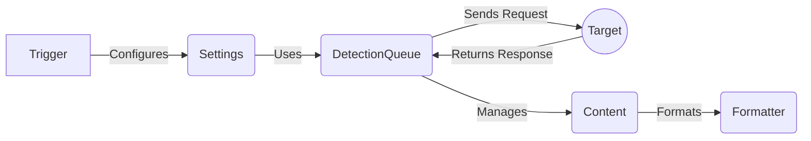

## Component Descriptions

**Component:** `Trigger`
   - *Description*: The entry point of the application, responsible for parsing command-line arguments, configuring settings, and initiating the detection process.
   - *Interaction*: Configures the `Settings` component with the parsed command-line arguments.
   - *Relevant Source Files*: `trigger.py`

**Component:** `Settings`
   - *Description*: Handles configuration and settings for the WhatWaf application, including retrieving pages, configuring request headers, and managing user agents and proxies.
   - *Interaction*: Used by `DetectionQueue` to configure HTTP requests.
   - *Relevant Source Files*: `lib.settings`

**Component:** `DetectionQueue`
   - *Description*: Manages the queue of detections to be performed, retrieves responses from the target, and handles threading for concurrent requests.
   - *Interaction*: Sends HTTP requests to the `Target` and receives responses. Manages the `Content` component for detection logic.
   - *Relevant Source Files*: `content.DetectionQueue`

**Component:** `Target`
    - *Description*: Represents the target web server being analyzed.
    - *Interaction*: Receives HTTP requests from `DetectionQueue` and returns HTTP responses.
    - *Relevant Source Files*: N/A (External System)

**Component:** `Content`
   - *Description*: Contains the main detection logic, including getting working tampers and executing the main detection process.
   - *Interaction*: Receives responses from `DetectionQueue` and formats the output using `Formatter`.
   - *Relevant Source Files*: `content.py`

**Component:** `Formatter`
   - *Description*: Handles the formatting and output of information, warnings, errors, and payloads.
   - *Interaction*: Receives data from `Content` and formats it for display.
   - *Relevant Source Files*: `lib.formatter`
