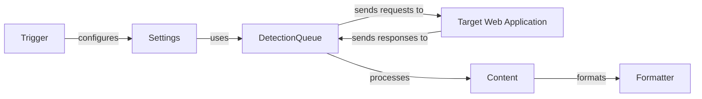

### Component Descriptions:

**1. Trigger**
   - *Description*: The entry point of the application. It configures the settings and initiates the WAF detection process.
   - *Functionality*: Parses command-line arguments, sets up configurations, and starts the detection process.
   - *Interaction*: Configures the `Settings` component.
   - *Relevant source files*: `repos.WhatWaf.trigger.main`

**2. Settings**
   - *Description*: Manages the application's settings and configurations.
   - *Functionality*: Retrieves web pages, configures request headers, generates random strings, and handles database interactions.
   - *Interaction*: Used by `DetectionQueue` to configure and send HTTP requests.
   - *Relevant source files*: `repos.WhatWaf.lib.settings`

**3. DetectionQueue**
   - *Description*: Manages the queue for sending HTTP requests and processing responses.
   - *Functionality*: Sends requests to the target web application, retrieves responses, and handles threading for concurrent requests.
   - *Interaction*: Sends requests to the `Target Web Application` and processes responses using `Settings` and `Content`.
   - *Relevant source files*: `WhatWaf.content.DetectionQueue`

**4. Target Web Application**
   - *Description*: The web application being tested for WAF protection.
   - *Functionality*: Receives HTTP requests and sends back responses.
   - *Interaction*: Receives requests from `DetectionQueue` and sends responses back.
   - *Relevant source files*: N/A (external component)

**5. Content**
   - *Description*: Contains the main logic for WAF detection.
   - *Functionality*: Gets working tampers, runs the main detection process, and identifies potential WAF protections.
   - *Interaction*: Processes responses from `DetectionQueue` and uses `Formatter` to format output.
   - *Relevant source files*: `repos.WhatWaf.content`

**6. Formatter**
   - *Description*: Provides formatting functionalities for different types of messages.
   - *Functionality*: Formats errors, warnings, info, payloads, and other messages for display.
   - *Interaction*: Used by `Content` to format output messages.
   - *Relevant source files*: `lib.formatter`
