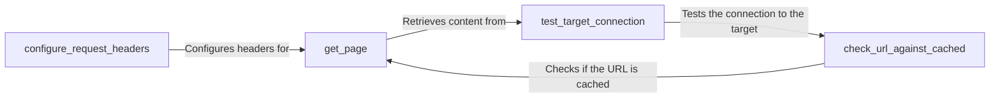

## Component Details

The Request Manager component is responsible for handling all aspects of creating and sending HTTP requests to a target server. It manages request headers, handles connection testing, and utilizes a caching mechanism to optimize performance by avoiding redundant requests. The component ensures that requests are properly formatted and transmitted, mimicking browser behavior where necessary.

### get_page
Retrieves the content of a web page by sending an HTTP request to the specified URL. It handles the actual network communication, including error handling and response processing, and returns the response content. This component is central to fetching web page data.
- **Source Reference**: `WhatWaf.lib.settings:get_page`
  - *File*: `WhatWaf/lib/settings.py`

### configure_request_headers
Configures the headers of an HTTP request. This includes setting the User-Agent, cookies, and other relevant headers to mimic browser behavior or specific client requirements. Proper header configuration is crucial for successful web requests.
- **Source Reference**: `WhatWaf.lib.settings:configure_request_headers`
  - *File*: `WhatWaf/lib/settings.py`

### test_target_connection
Tests the connection to the target server by sending a simple HTTP request. This is used to verify that the target is reachable and responsive before proceeding with more complex requests. This ensures that the application can communicate with the target before attempting to retrieve data.
- **Source Reference**: `WhatWaf.lib.settings:test_target_connection`
  - *File*: `WhatWaf/lib/settings.py`

### check_url_against_cached
Checks if the content for a given URL is already stored in the cache. If a cached version exists and is still valid, it is retrieved to avoid making a new HTTP request. This improves performance and reduces the load on the target server.
- **Source Reference**: `WhatWaf.lib.settings:check_url_against_cached`
  - *File*: `WhatWaf/lib/settings.py`