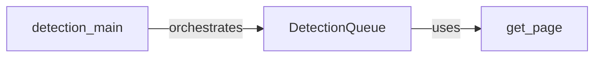

## Component Details

The Request/Response Handler is responsible for managing the sending of HTTP requests to a target web server and processing the responses to detect the presence of a Web Application Firewall (WAF). It utilizes a detection queue to manage concurrent requests and passes the responses to the Firewall Analyzer for detection. The handler ensures efficient and reliable communication with the target web server.

### DetectionQueue
The DetectionQueue class manages a queue of HTTP requests to be sent to the target web server. It uses threading to send requests concurrently, improving performance. It also handles the processing of responses, passing them to the appropriate analysis components for WAF detection.
- **Related Classes/Methods**: `WhatWaf.content.DetectionQueue` (58:217), `WhatWaf.content.DetectionQueue:get_response` (82:142), `WhatWaf.content.DetectionQueue:threader` (144:149), `WhatWaf.content.DetectionQueue:threaded_get_response_helper` (151:190), `WhatWaf.content.DetectionQueue:threaded_get_response` (192:217)

### detection_main
The detection_main function serves as the entry point for the WAF detection process. It initializes the DetectionQueue, populates it with HTTP requests, and orchestrates the analysis of the responses to determine the presence and type of WAF.
- **Related Classes/Methods**: `WhatWaf.content:detection_main` (395:729)

### get_page
The get_page function is responsible for sending individual HTTP requests to the target web server and retrieving the responses. It handles setting up the request, sending it, and processing the response headers and body. It likely uses libraries like `requests` to perform the HTTP communication.
- **Related Classes/Methods**: `WhatWaf.lib.settings:get_page` (354:408)