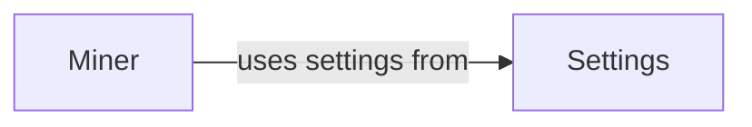

## Component Details

The Resource Miner component is responsible for managing and executing external miners to perform resource-intensive tasks, such as identifying web application firewalls (WAFs). It integrates with the application's settings to configure the mining process and handles the installation, initialization, and execution of mining tasks, offloading computationally expensive operations from the main application thread.

### Settings
The Settings component manages the configuration for the WhatWaf application. It loads, parses, and provides access to settings required by other modules, including those related to the miner, such as whether mining is enabled and miner-specific configurations.
- **Related Classes/Methods**: `WhatWaf.lib.settings:do_mine_for_whatwaf` (965:970)

### Miner
The Miner component manages the mining process, which involves discovering and identifying web application firewalls (WAFs). It handles the installation, initialization, and execution of mining tasks, potentially using external tools or scripts. It uses settings from the Settings component to configure the mining process.
- **Related Classes/Methods**: `WhatWaf.lib.miner.Miner` (28:147), `WhatWaf.lib.miner.Miner:__do_miner_install` (55:78), `WhatWaf.lib.miner.Miner:init` (80:95), `WhatWaf.lib.miner.Miner:main` (111:147)