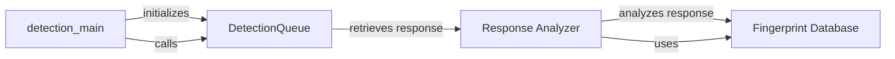

## Component Details

The WhatWaf system identifies Web Application Firewalls (WAFs) by analyzing HTTP responses. The process starts with `detection_main`, which initializes and manages the detection queue. The `DetectionQueue` component retrieves HTTP responses, and the `Response Analyzer` component then analyzes these responses to detect WAF presence and type using signature matching, behavioral analysis, and anomaly detection techniques. The `Fingerprint Database` provides the signatures and patterns used by the `Response Analyzer` for WAF identification. The results are then processed and reported.

### detection_main
The main entry point for the WAF detection process. It initializes the detection queue, adds detection tasks, and processes the results.
- **Source Reference**: `WhatWaf.content:detection_main`
  - *File*: `WhatWaf/content.py`

### DetectionQueue
Manages a queue of detection tasks, providing a method (`get_response`) to retrieve the response for a given task.
- **Source Reference**: `WhatWaf.content.DetectionQueue`
  - *File*: `WhatWaf/content.py`
- **Source Reference**: `WhatWaf.content.DetectionQueue:get_response`
  - *File*: `WhatWaf/content/DetectionQueue.py`

### Response Analyzer
The Response Analyzer component analyzes HTTP responses received from the target server to detect the presence and type of WAF. It employs signature matching, behavioral analysis, and anomaly detection techniques to identify WAFs based on response characteristics. This component is central to the WAF detection process and relies on the Fingerprint Database for accurate identification.
- **Source Reference**: `WhatWaf.content.DetectionQueue:get_response`
  - *File*: `WhatWaf/content/DetectionQueue.py`
- **Source Reference**: `WhatWaf.content:detection_main`
  - *File*: `WhatWaf/content.py`

### Fingerprint Database
A database containing WAF signatures and patterns used by the Response Analyzer to identify WAFs. It provides the necessary data for signature matching and behavioral analysis.
- **Related Classes/Methods**: _None_