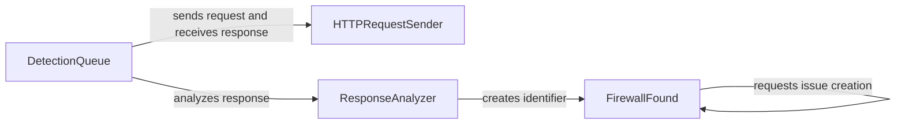

## Component Details

The WhatWaf system identifies Web Application Firewalls (WAFs) by sending HTTP requests and analyzing the responses. The DetectionQueue manages the process by sending requests via the HTTPRequestSender and then uses the ResponseAnalyzer to examine the responses. If a WAF is detected, the FirewallFound component creates identifiers and requests issue creation.

### FirewallFound
This component is responsible for creating identifiers for detected firewalls and requesting the creation of issues related to them. It encapsulates the logic for uniquely identifying a firewall based on its characteristics and triggering the reporting process.
- **Related Classes/Methods**: `WhatWaf.lib.firewall_found`

### DetectionQueue
This component manages a queue of requests for detecting WAFs. It handles sending these requests in a threaded manner and retrieving the responses. It includes logic for managing concurrency and handling potential errors during the request-response cycle.
- **Related Classes/Methods**: `WhatWaf.content.DetectionQueue`

### HTTPRequestSender
This component is responsible for sending HTTP requests and receiving responses. It encapsulates the logic for making network requests, handling headers, and managing connections. It is used by the DetectionQueue to send requests to the target.
- **Related Classes/Methods**: `WhatWaf.content.DetectionQueue`

### ResponseAnalyzer
This component analyzes the HTTP responses received from the target to identify the WAF in use. It extracts relevant information from the response headers and body to determine the firewall's characteristics.
- **Related Classes/Methods**: `WhatWaf.content.DetectionQueue`
