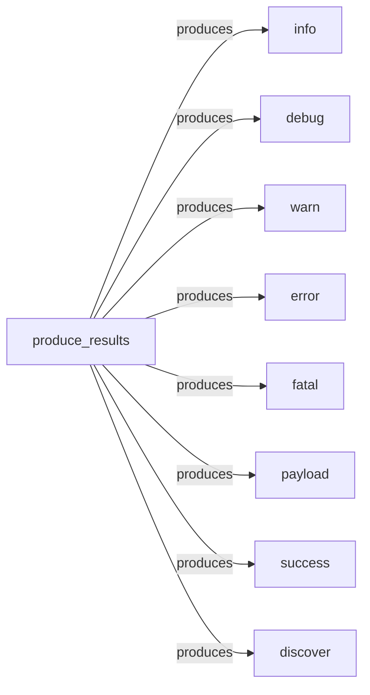

## Component Details

The Result Formatter component in WhatWaf is responsible for taking the raw detection results and presenting them in a user-friendly format. It provides various output formats, including text, JSON, and HTML, to cater to different user needs and preferences. The component includes functions for displaying different types of messages, such as informational, debugging, warning, error, and success messages, as well as payload and discovery information. The `produce_results` function acts as the central point for generating the final output, utilizing the other formatting functions to create a comprehensive and informative report.

### produce_results
This function orchestrates the final output generation, aggregating and formatting the data collected during the WAF detection process. It acts as the entry point for presenting the results to the user.
- **Source Reference**: `WhatWaf.lib.settings:produce_results`
  - *File*: `WhatWaf/lib/settings.py`

### info
This function formats and displays informational messages to the user, providing context and updates on the WAF detection process.
- **Source Reference**: `WhatWaf.lib.formatter:info`
  - *File*: `WhatWaf/lib/formatter.py`

### debug
This function formats and displays debugging messages, which are useful for developers to understand the internal workings of the application and troubleshoot issues.
- **Source Reference**: `WhatWaf.lib.formatter:debug`
  - *File*: `WhatWaf/lib/formatter.py`

### warn
This function formats and displays warning messages, indicating potential issues or anomalies that may require attention.
- **Source Reference**: `WhatWaf.lib.formatter:warn`
  - *File*: `WhatWaf/lib/formatter.py`

### error
This function formats and displays error messages, indicating that an error has occurred during the WAF detection process.
- **Source Reference**: `WhatWaf.lib.formatter:error`
  - *File*: `WhatWaf/lib/formatter.py`

### fatal
This function formats and displays fatal error messages, indicating a critical error that prevents the application from continuing.
- **Source Reference**: `WhatWaf.lib.formatter:fatal`
  - *File*: `WhatWaf/lib/formatter.py`

### payload
This function formats and displays payload information, which is likely related to the data being sent or received during the WAF detection process.
- **Source Reference**: `WhatWaf.lib.formatter:payload`
  - *File*: `WhatWaf/lib/formatter.py`

### success
This function formats and displays success messages, indicating that a particular task or operation has been completed successfully.
- **Source Reference**: `WhatWaf.lib.formatter:success`
  - *File*: `WhatWaf/lib/formatter.py`

### discover
This function formats and displays information about discovered items, which could be related to WAFs or other security-related components.
- **Source Reference**: `WhatWaf.lib.formatter:discover`
  - *File*: `WhatWaf/lib/formatter.py`