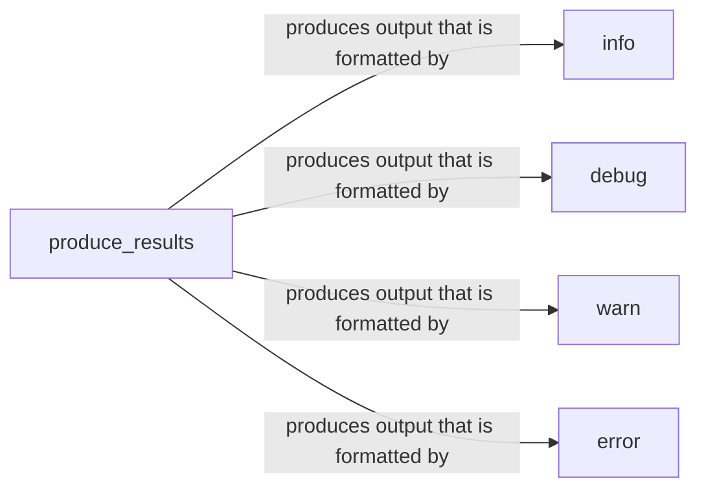

## Component Details

The Result Presentation component focuses on formatting and displaying scan results to the user in a clear and informative manner. It encompasses functions for presenting information, warnings, errors, and debug messages, ensuring that users can easily understand the findings of the scan. The `produce_results` function acts as a central aggregator, collecting results and delegating the formatting to the specific message type functions.

### produce_results
This function aggregates the results from the scan and prepares them for output. It acts as the central point for collecting and formatting the final results, calling the appropriate formatting functions based on the message type.
- **Related Classes/Methods**: `WhatWaf.lib.settings:produce_results`

### info
This function formats and prints informational messages to the user, providing general information about the scan process and findings. It ensures that informational messages are displayed in a consistent and user-friendly format.
- **Related Classes/Methods**: `WhatWaf.lib.formatter:info`

### debug
This function formats and prints debugging messages, offering detailed output for developers or troubleshooting purposes. It provides a way to display verbose information that can be helpful in diagnosing issues.
- **Related Classes/Methods**: `WhatWaf.lib.formatter:debug`

### warn
This function formats and prints warning messages, indicating potential issues or unusual conditions that may not be critical errors but warrant attention. It alerts the user to possible problems that should be investigated.
- **Related Classes/Methods**: `WhatWaf.lib.formatter:warn`

### error
This function formats and prints error messages, reporting critical problems that prevent the program from functioning correctly. It informs the user of serious issues that need to be resolved.
- **Related Classes/Methods**: `WhatWaf.lib.formatter:error`